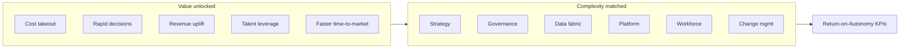
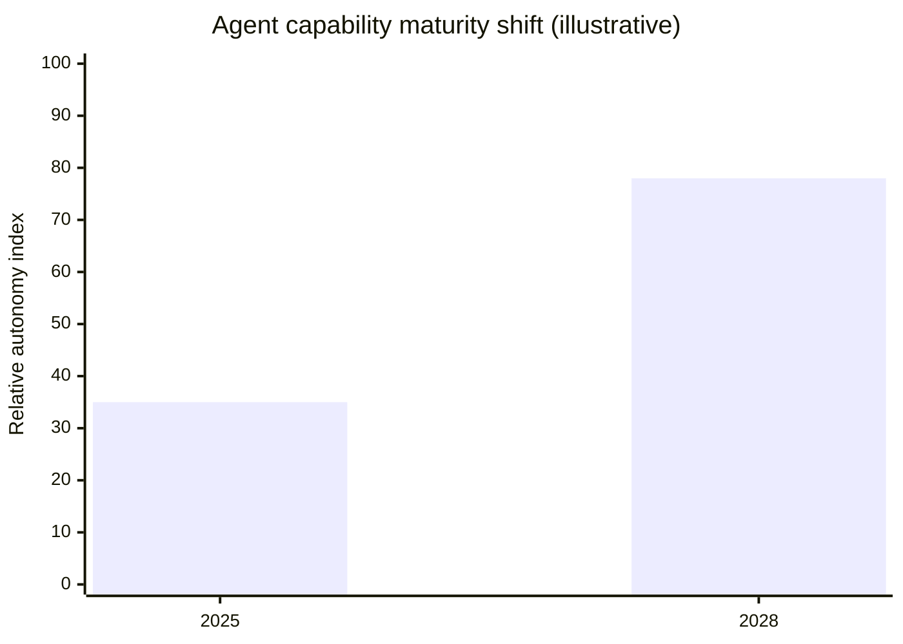
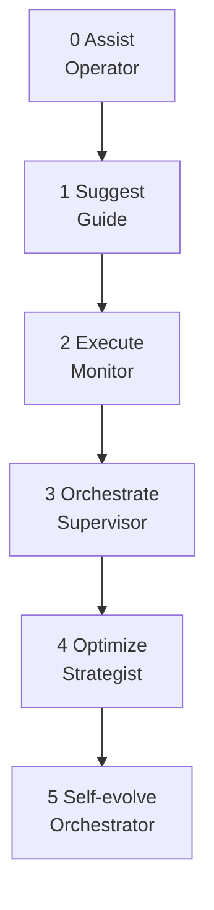
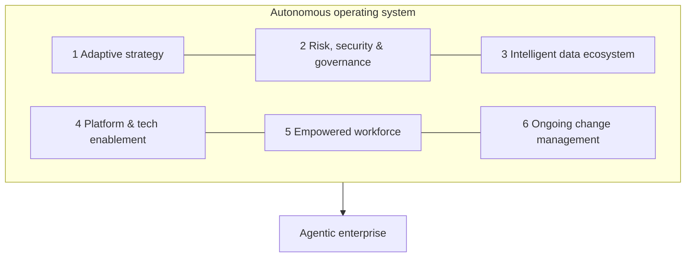
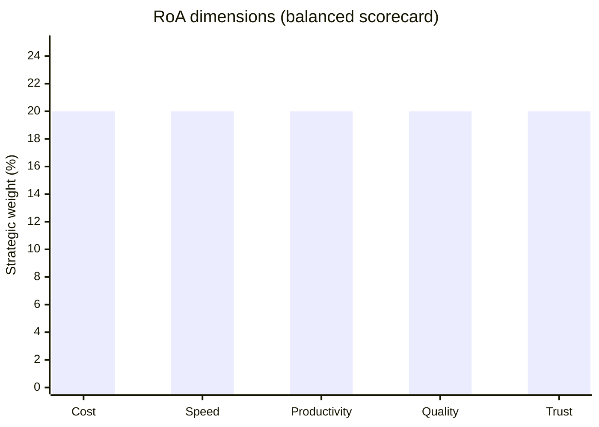
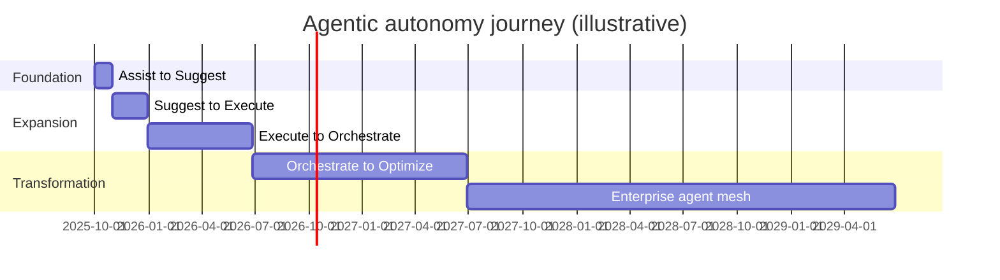

# Agentic Enterprise 2028 — Summary & Conclusion

**Source:** Deloitte AI Institute, *Agentic enterprise 2028: A blueprint for cost savings, job creation, and faster growth through agentic AI* (September 2025)  
**Full report:** [../../images/agentic-ai-enterprise-2028.pdf](../../images/agentic-ai-enterprise-2028.pdf)  
**Visual edition:** [agentic-ai-enterprise-2028-summary.html](./agentic-ai-enterprise-2028-summary.html)  
**Related:** [State of AI 2026 summary](./state-of-ai-2026-summary.md) · [GitHub agentic IT control plane](../architecture/github-agentic-it-control-plane.md)  
**Applied roadmap:** [IT Cloud Team Agentic AI roadmap](../roadmaps/it-cloud-team-ai-roadmap.md)  
**Merged implementation plan:** [Agentic Enterprise 2028 — IT Cloud implementation plan](../roadmaps/agentic-enterprise-2028-it-cloud-implementation-plan.md)

---

## Executive summary

Agentic AI is not the next wave of automation — it is the **operating logic of tomorrow's enterprise**. Organizations that embrace autonomy by 2028 will likely reclaim operating costs, release products faster, and redeploy talent to higher-value work. Autonomy means empowering intelligent agents to sense their environment, make decisions, and act with minimal human oversight — at scale, when supplied with high-quality data and well-defined governance.

The benefits are substantial but matched by complexity. Realizing them requires climbing a **six-step autonomy ladder** grounded in replatforming technology, reskilling talent, revising risk management, and redesigning work. Deloitte's **Return-on-Autonomy (RoA)** dashboard gives leaders industry-agnostic KPIs to gauge impact, calibrate investment, and course-correct early.

---

## Key takeaways at a glance

| Theme | Headline | Implication |
| --- | --- | --- |
| Strategic shift | Agentic AI = operating logic, not smarter automation | Requires systemic transformation, not plug-in pilots |
| Why now | 77% of CEOs say AI shapes business; 2/3 say models aren't ready | Competitive clock is ticking |
| Tech momentum | Gartner: 1/3 of enterprise apps embed agents by 2028 | Platform shift is underway |
| Autonomy ladder | 6 maturity levels from Assist to Self-evolve | Phased journey, not binary rollout |
| 2028 outlook | Execute-level penetration: 25–30% today → 55–65% | Bounded autonomy scales first |
| Six pillars | Strategy, governance, data, platform, workforce, change | All dimensions must evolve concurrently |
| Workforce | Humans shift from operators to orchestrators | New roles emerge; skilled trades boom |
| Measurement | RoA KPIs across cost, speed, productivity, quality, trust | Prove value at process and portfolio level |

---

## Why now? The imperative for autonomy

Three macro forces compress the decision window for agentic AI:

| Force | Signal | Strategic response |
| --- | --- | --- |
| **Competitive pressure** | 77% of CEOs say AI will shape the future of business; two-thirds concede their business model isn't ready | Move from experimentation to operating-model redesign |
| **Regulatory scrutiny** | EU AI Act and US executive orders codify obligations for high-risk AI | Turn compliance into differentiator via auditability and reporting |
| **Tech momentum** | Gartner forecasts one-third of enterprise applications will embed autonomous agents by 2028 | Invest in platform, data, and integration patterns now |

Agentic AI turns compliance from cost center to differentiator — firms that bake in auditability can fast-track market entry and secure lower cost of capital.

---

## 2025 vs. 2028: Capability evolution

| Capability | 2025 | 2028 (projected) |
| --- | --- | --- |
| Autonomy & decision-making | Primarily human-in-the-loop, rule-bound | Proactive decisions; human as reviewer |
| Reasoning & planning | Structured problems, short-term planning | Strategic, real-time adaptive planning |
| Natural language | Context-aware chat and commands | Near-human understanding across languages |
| Task complexity | Repetitive, rule-based tasks | Multistep workflows toward defined outcomes |
| Multi-agent systems | Early, small-scale (e.g., LangGraph) | Specialized agent teams mirroring human teams |
| Integration | Point solutions (help desk, customer service) | Enterprise-wide via low/no-code integration |
| Learning | Learns from explicit feedback | Self-improving via reinforcement and observation |

---

## The autonomy ladder

Agentic capabilities span a spectrum from basic task automation to self-governing agent meshes. Six maturity plateaus define the climb:

| Level | Name | Primary human role | 2025 penetration | 2028 outlook |
| --- | --- | --- | --- | --- |
| 0 | **Assist** | Operator | 70–80%+ | 90–97% |
| 1 | **Suggest** | Guide | 50–60% | 75–85% |
| 2 | **Execute** | Monitor | 25–30% | 55–65% |
| 3 | **Orchestrate** | Supervisor | 8–10% | 25–35% |
| 4 | **Optimize** | Strategist | 2–3% | 10–18% |
| 5 | **Self-evolve** | Orchestrator | <1% | 5–10% |

*Penetration = at least one production-grade deployment at scale (not pilot/POC). 2028 outlook is scenario-based and illustrative.*

**Example use-case progression (Customer Experience):**

- **Assist:** FAQ returns chatbot
- **Suggest:** Cross-sell prompts during live chat
- **Execute:** End-to-end refund processing
- **Orchestrate:** Proactive outreach to customers predicted to cancel
- **Optimize:** Full-funnel marketing campaign design and launch
- **Self-evolve:** Real-time catalog and offer evolution by agent mesh

---

## Six pillars: Architecting the autonomous operating system

Scaling agentic autonomy requires concurrent evolution across six dimensions:

### 1. Adaptive strategy

Three integration patterns:

| Pattern | Description | When to use |
| --- | --- | --- |
| **Agents overlay** | Enhance existing workflows without fundamental change | Quick wins, incremental automation |
| **Agents as-a-service** | Pre-built agentic features in SaaS (CRM, ERP, HR) | Rapid adoption via platform providers |
| **Agents by design** | Re-architect processes as networks of collaborating agents | Maximum differentiation; core transformation |

Key actions: multidimensional readiness assessment, layered rollout strategy, dynamic use-case scoring, Agentic Center of Excellence (CoE).

### 2. Proactive risk, security, and governance

Agentic systems thrive on trust. **Guardian agents** — supervisory systems that monitor, validate, and manage other agents — are emerging as a scalable oversight model.

**Illustrative risk levels:**

| Level | Business impact | Autonomy | Example |
| --- | --- | --- | --- |
| Low | Non-critical workflow | Pre-defined, repeatable | Research support |
| Medium | Semi-critical | Semi-autonomous with checkpoints | IT help desk |
| High | Mission-critical | Fully autonomous, multi-agent | Finance, HR |

Focus areas: agent-specific risk frameworks, cross-functional AI governance, policy-as-code, transparency and human oversight.

### 3. Intelligent data ecosystem

Agents are only as effective as the data that fuels them. A **convergence architecture** unifies operational and analytical data; a **vectorized data fabric** gives agents low-latency, context-rich retrieval. Human expertise must be captured alongside data — tacit knowledge is a critical dependency.

### 4. Scalable platform and tech enablement

Evolve from traditional API-driven architectures to **MCP** (Model Context Protocol), **A2A** (Agent-to-Agent), and **MAS** (multi-agent systems) architectures. Establish an **agent-mesh orchestration layer** treating the agent fleet like a cloud-native microservices mesh.

### 5. Empowered workforce

Humans are redefined, not replaced. Impact varies by work type:

| Work type | Agent impact | Human shift |
| --- | --- | --- |
| Knowledge: rote/structured | Very high automation | Exception triage, orchestration |
| Knowledge: domain/complex | Selective automation | Lead judgment; agents as co-analysts |
| Tech | High automation of boilerplate | System design, orchestration, governance |
| Creative | Routine production automated | Direction, brand alignment, curation |
| Frontline: general | High automation of repetitive tasks | Exceptions, customer experience |
| Skilled trade | Limited displacement | Augmented diagnostics, safety checks |

**New roles emerging:** Agentic Process Architect, Multi-agent Systems Engineer, Autonomy Auditor, Human-AI Interaction Coach, Trust Lead, Continuous-Learning Steward, and more.

Global AI infrastructure spending is projected to surpass **$200 billion by 2028**, fueling a parallel boom in skilled-trade jobs (data center electricians, immersion-cooling HVAC technicians, edge-compute engineers).

### 6. Ongoing change management

Traditional change management is insufficient. Context:

- Record-low trust undermining AI adoption
- Employee willingness to support change dropped from **74% (2016)** to **44% (2024)**
- **75%** of workers crave stability; **85%** of leaders say organizations must become more agile
- **54%** concerned about blurred human-machine contributions

Community benefit and brand trust must be designed into the agentic roadmap — every automated interaction is a public touchpoint.

---

## Measuring impact: Return-on-Autonomy (RoA)

Value compounds as organizations climb the ladder — each level lays groundwork for the next. RoA KPIs span five dimensions:

| Dimension | Process/workflow KPI | Portfolio/enterprise KPI |
| --- | --- | --- |
| **Cost** | Unit cost/transaction % reduction | Total operating cost % change YoY |
| **Speed** | Median process cycle time | Speed-to-market (weeks to deployment) |
| **Productivity** | Autonomy rate (% tasks end-to-end) | Output per FTE index at 100 |
| **Quality** | First-pass yield | Enterprise defect/audit-finding rate |
| **Trust** | In-workflow satisfaction rating | Agent reliability (% workflows without escalation) |

**How to use:** Establish 2025 baseline → set evidence-based 2028 aspiration line → instrument with automated feeds → review quarterly.

---

## Pragmatic implementation roadmap

Treat autonomy as a **staged journey**, not a plug-in feature. Each phase builds unique assets (data, talent, guardrails) for the next leap.

| Phase | Timeline | Level transition | Primary value unlock |
| --- | --- | --- | --- |
| **Foundation** | First 30 days | Assist → Suggest | AI proposes single-step options |
| **Pilot expansion** | First 90 days | Suggest → Execute | AI executes bounded tasks end-to-end |
| **Hybrid flows** | Next 180 days | Execute → Orchestrate | Multistep workflows with human exceptions |
| **By-design pilots** | By month 12 | Orchestrate → Optimize | Closed-loop optimization of value chains |
| **Enterprise network** | Years 2–3 | Optimize → Self-evolve | Self-improving agent mesh |

**Quick wins vs. transformation decision matrix:**

| Consideration | Quick wins (overlay/as-a-service) | Transformation (by design) |
| --- | --- | --- |
| Process clarity | Partially defined | All processes mapped |
| Data readiness | Moderately connected | Robust data fabric |
| Compute | Somewhat elastic | Fully elastic, cloud-native |
| Risk | Low–moderate stakes | Mission-critical, policy-as-code |
| Talent | Incremental reskilling | Work redesign central |
| Cost | Cheaper to integrate legacy | Redesign cost-justified |

---

## Conclusion

### Act early, scale confidently

Agentic AI is not a singular rollout — it is a **phased transformation**, much like the shift from steam to electricity on the factory floor. Organizations that start now will likely do more than unlock incremental efficiency; they will create **adaptive operating models** that learn, self-optimize, and compound value over time.

### What early movers gain

- Reclaimed operating costs through accelerated processes and near-zero rework
- Faster time-to-market via autonomous mesh architectures
- Talent redeployed to orchestration, reliability, and strategic oversight
- Influence over regulations and industry standards
- Competitive barriers that challenge later entrants

### What holds organizations back

- Treating agents as plug-in features rather than operating-model change
- Scaling autonomy without proportional governance (guardian agents, policy-as-code)
- Fragmented data pipelines that agents inherit as weaknesses
- API-only integration that bottlenecks multi-agent orchestration
- Fluency programs without role redesign and dynamic talent pipelines
- Change management that ignores record-low trust and workforce stagility tensions

### Strategic questions for leaders

| Pillar | Question |
| --- | --- |
| **Strategy** | How can we leverage agentic autonomy to reinforce core objectives, brand promise, and competitive advantage? |
| **Governance** | What controls and oversight should we establish to identify, monitor, and mitigate risks from autonomous decisions? |
| **Data** | Do we have scalable, high-quality data pipelines and feedback loops to train, monitor, and improve agents? |
| **Platform** | Which platform upgrades, integration patterns (MCP/A2A/MAS), and orchestration capabilities are critical to scale agents? |
| **Workforce** | How should we reskill, redeploy, and engage talent so the workforce thrives alongside increasing autonomy? |

### Bottom line

Treat autonomy as a **staged journey with well-defined stages, measurable milestones, and cross-functional ownership**. The message is clear: those who move first — methodically but decisively — are better positioned to capture outsized gains and help define the playbook for the agentic enterprise era. Each phase builds the data, talent, and guardrails that prepare the enterprise for the next leap, ensuring autonomy delivers **durable advantage** rather than siloed efficiency gains.

---

*This summary is derived from Deloitte's Agentic enterprise 2028 report (September 2025). For the full report, frameworks, use-case tables, and citations, see the [original PDF](../../images/agentic-ai-enterprise-2028.pdf) or visit the [Deloitte AI Institute](https://www.deloitte.com/us/AIInstitute).*
