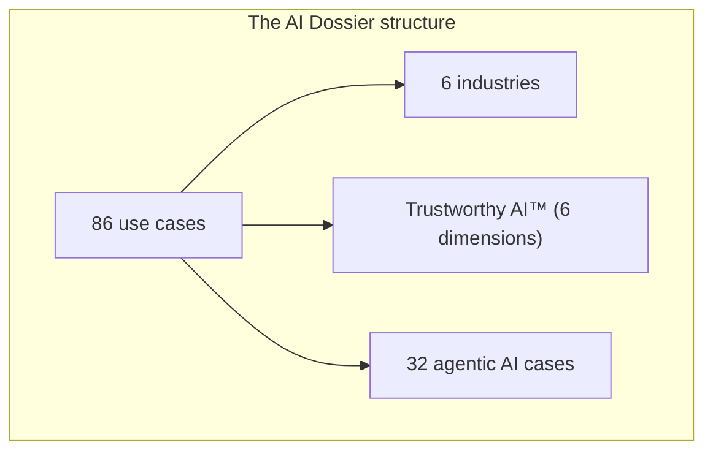
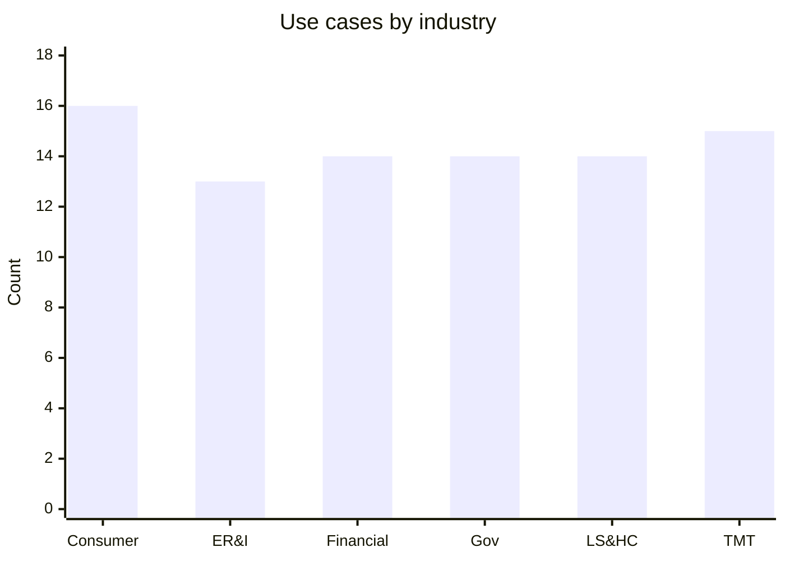
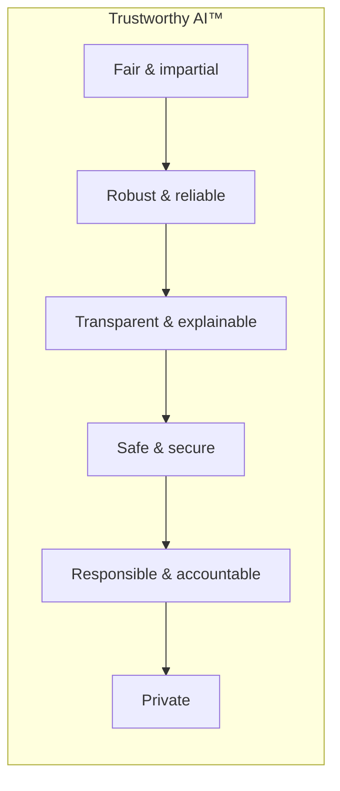
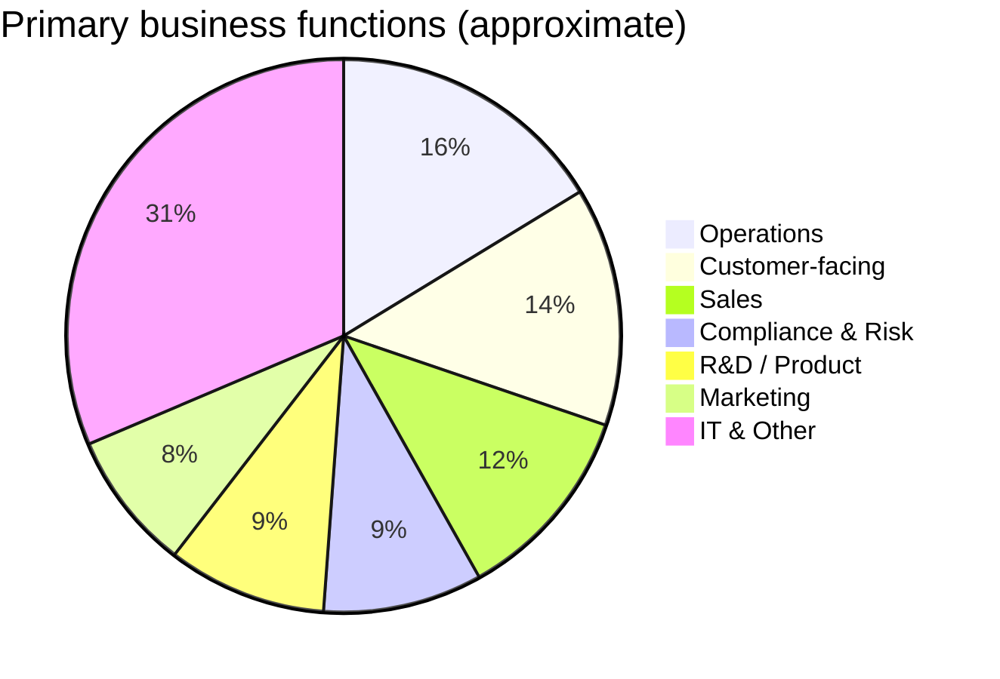
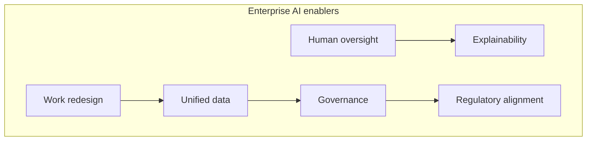

# The AI Dossier — Summary & Conclusion

**Source:** Deloitte AI Institute, *The AI Dossier: A selection of high-impact use cases across six major industries*  
**Scope:** 86 AI use cases across Consumer, Energy/Resources/Industrials, Financial Services, Government & Public Services, Life Sciences & Health Care, and Technology/Media/Telecommunications  
**Full report:** [images/ai-dossier.pdf](../../images/ai-dossier.pdf)  
**Visual edition:** [ai-dossier-summary.html](./ai-dossier-summary.html)

---

## Executive summary

*The AI Dossier* is a compendium of **86 high-impact AI use cases** spanning six major industries. Each case illustrates how organizations can apply AI — increasingly through **agentic systems** that plan, coordinate, and execute multi-step workflows — to address enterprise challenges in new ways.

The dossier is structured as a practical catalog, not a technology forecast. Every use case follows a consistent pattern:

1. **Issue/opportunity** — the business problem or friction point
2. **How AI can help** — capabilities, often via specialized agents
3. **Potential benefits** — efficiency, revenue, risk reduction, customer experience
4. **Managing risk and promoting trust** — mapped to Deloitte's **Trustworthy AI™** framework

The central message: AI's capabilities — from generative models to autonomous agents — are opening innovations that were unthinkable a few years ago. But **every powerful tool presents risks**, and sustainable advantage comes from deploying AI with transparency, oversight, and measurable impact.

---

## Document structure

| Element | Description |
| --- | --- |
| Industries covered | 6 major sectors |
| Use cases | 86 total |
| Agentic AI cases | 32 (~37%) |
| Per-use-case tags | Primary business function + Agentic AI indicator |
| Risk framework | Trustworthy AI™ — 6 trust dimensions on every case |

Each industry section opens with sector context, then presents use cases in a repeatable template designed for quick scanning and deeper evaluation.

---

## Use cases by industry

| Industry | Use cases | Agentic | Sector theme |
| --- | ---: | ---: | --- |
| Consumer | 16 | 6 | Real-time engagement, personalization, autonomous retail & supply chain |
| Energy, Resources & Industrials | 13 | 4 | Asset optimization, predictive maintenance, field operations, grid efficiency |
| Financial Services | 14 | 5 | Risk/compliance, hyper-personalization, algorithmic operations |
| Government & Public Services | 14 | 5 | Regulatory efficiency, citizen services, policy intelligence |
| Life Sciences & Health Care | 14 | 6 | Clinical decision support, drug discovery, payer/provider automation |
| Technology, Media & Telecommunications | 15 | 5 | Software development, technical sales, content, network operations |
| **Total** | **86** | **32** | |

---

## Trustworthy AI™ framework

Every use case includes a **Managing risk and promoting trust** section aligned to six dimensions:

| Dimension | Focus |
| --- | --- |
| **Fair and impartial** | Consistent treatment; avoiding bias across customers, regions, or cohorts |
| **Robust and reliable** | Data validation, human escalation, continuous monitoring against real outcomes |
| **Transparent and explainable** | Clear reasoning, audit trails, citations to sources and rules |
| **Safe and secure** | Access controls, encryption, protection against unauthorized disclosure |
| **Responsible and accountable** | Human oversight for high-stakes decisions; alignment with policy and brand |
| **Private** | Minimizing PII exposure; compliance with data governance and retention rules |

This framework runs through all 86 cases — signaling that **governance is not an appendix** but a core design requirement for enterprise AI.

---

## Key themes across industries

### 1. Agentic AI is moving from concept to operations

Roughly **one in three** use cases (32 of 86) explicitly involve **agentic AI** — systems with specialized agents that collaborate, negotiate trade-offs, and execute multi-step workflows. Examples span:

- **Consumer:** Dynamic pricing + inventory optimization; AI-orchestrated product design; next-generation store operations
- **Financial Services:** 24/7 risk management; algorithmic trading; credit decisioning; intraday liquidity
- **Life Sciences:** Multi-modal diagnosis; hyper-personalized care; end-to-end autonomous supply chain
- **TMT:** Technical sales agents; customer success; software development and service operations

Agentic patterns recur: **specialized agents**, **shared situational awareness**, **human-in-the-loop** for final decisions, and **validator/explainer agents** for trust.

### 2. Business functions — where AI lands

| Business function | Use cases |
| --- | ---: |
| Operations | 14 |
| Customer Service / Experience | 12 |
| Sales | 10 |
| Compliance & Risk | 8 |
| R&D / Product Development | 8 |
| Marketing | 7 |
| Information Technology | 5 |
| Field Services | 4 |
| Procurement / Supply Chain | 3 |
| Other (cross-functional, L&D, manufacturing) | 15 |

Operations and customer-facing functions dominate — reflecting AI's dual role in **back-office efficiency** and **front-office differentiation**.

### 3. Industry-specific patterns

**Consumer** — AI resets how consumers discover, evaluate, and interact with brands. Winners align AI to strategic goals, unified data, and governance — not just speed of adoption.

**Energy, Resources & Industrials** — Asset-intensive sectors use AI for predictive maintenance, autonomous field/drone operations, ore analysis, safety training, and grid optimization.

**Financial Services** — AI shifts from experimental to essential: fraud/AML monitoring, hyper-personalized banking, algorithmic trading, and legacy modernization — with heightened fairness and accountability scrutiny.

**Government & Public Services** — AI modernizes permitting, benefits delivery, regulatory compliance, urban planning simulation, multilingual citizen services, and policy tracking.

**Life Sciences & Health Care** — High-stakes environments demand rigorous validation. Use cases span clinical decision support, smarter trials, payer automation, lab optimization, and impurity detection.

**Technology, Media & Telecommunications** — AI reshapes software development, chip design/testing, technical sales, content creation, archive digitization, and network operations.

---

## Representative use cases (highlights)

### Consumer
| Use case | Agentic | Function |
| --- | --- | --- |
| Dynamic pricing and inventory optimization | Yes | Sales |
| AI-orchestrated product design | Yes | R&D |
| Next-generation store operations | Yes | Operations |
| Autonomous supply chain operations | Yes | Supply chain |
| Marketing content assistant | No | Marketing |
| Virtual try-on (Seeing is believing) | No | Customer service |

### Financial Services
| Use case | Agentic | Function |
| --- | --- | --- |
| AI-powered risk management and regulatory compliance | Yes | Compliance |
| Ultra-personalized banking | Yes | Customer experience |
| AI agents for algorithmic trading | Yes | Operations |
| AI agents for credit decisioning | Yes | Operations |
| Virtual bank experience | No | Customer experience |

### Life Sciences & Health Care
| Use case | Agentic | Function |
| --- | --- | --- |
| Multi-modal diagnosis and clinical decision support | Yes | Operations |
| Hyper-personalized health care | Yes | Customer experience |
| Smarter clinical trials | Yes | R&D |
| End-to-end autonomous supply chain | Yes | Supply chain |
| Physician's AI assistant | No | Operations |

### Technology, Media & Telecommunications
| Use case | Agentic | Function |
| --- | --- | --- |
| AI-powered technical sales | Yes | Sales |
| AI agents for customer success | Yes | Customer service |
| AI agents for software development | Yes | IT |
| AI-powered RFP and knowledge assistant | No | Sales |
| AI-powered archive access and extraction | No | Operations |

---

## Cross-cutting implementation requirements

Across all 86 cases, successful deployment depends on recurring enablers:

1. **Unified data infrastructure** — agents need reliable, structured, real-time data
2. **Human-in-the-loop oversight** — especially for financial, clinical, and regulatory decisions
3. **Explainability by design** — audit trails, citations, and reasoning for every recommendation
4. **Governance integrated with existing risk structures** — not bolted on after deployment
5. **Work and process redesign** — AI layered onto legacy workflows underdelivers
6. **Regulatory and ethical alignment** — sector-specific (HIPAA, AML, safety standards, IP)

---

## Conclusion

*The AI Dossier* makes a clear argument: **AI's scope and reach are expanding faster than most organizations can absorb**, but the technology is already capable of transforming core business functions — not just automating peripheral tasks.

### What the dossier demonstrates

- **Breadth:** 86 concrete, industry-specific use cases with business context, not abstract capability lists
- **Depth:** Each case addresses real operational friction — siloed pricing/inventory, manual warranty adjudication, fragmented clinical data, legacy archive formats
- **Agentic shift:** A significant share of cases now feature multi-agent orchestration, not single-model prompts
- **Trust by design:** Trustworthy AI™ is embedded in every case, not relegated to a compliance appendix

### What organizations should take away

1. **Start with the business problem, not the model** — every case begins with issue/opportunity, not technology
2. **Treat agentic AI as an operating model** — specialized agents, coordination, escalation, and human accountability
3. **Invest in foundations before scale** — data quality, governance, security, and explainability appear in virtually every risk section
4. **Sector context matters** — the same AI pattern (e.g., multi-agent orchestration) manifests differently in retail, banking, and clinical care
5. **Use the catalog as inspiration** — the foreword explicitly states the goal is to "spark new ideas" and "set organizations on a path to harness the maximum value"

### The strategic divide

Organizations that treat AI as a **point solution** (chatbots, content generation, isolated pilots) will capture efficiency gains. Organizations that treat AI as **infrastructure for decision-making and operations** — with agents, governance, and work redesign — will capture differentiation.

The dossier is a snapshot of what AI can do **today**. As the foreword notes, more impressive use cases are coming — including those not yet imagined. The competitive edge will go to organizations that combine **technical capability with trustworthy deployment**.

### Bottom line

*The AI Dossier* is less a prediction of AI's future and more a **practical map of AI's present** — 86 proof points that AI can address enterprise challenges across every major industry. The question for leaders is not whether these patterns apply to their organization, but **which use cases to prioritize**, **what foundations to build first**, and **how to deploy with the transparency and accountability the Trustworthy AI™ framework demands.

---

*This summary is derived from Deloitte's The AI Dossier (Deloitte AI Institute). For the full use case catalog, risk guidance, and industry context, see the [original publication](../../images/ai-dossier.pdf).*
