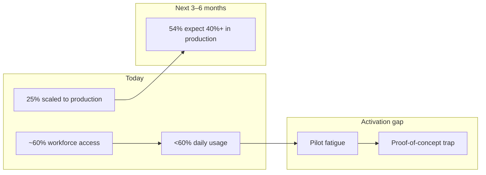
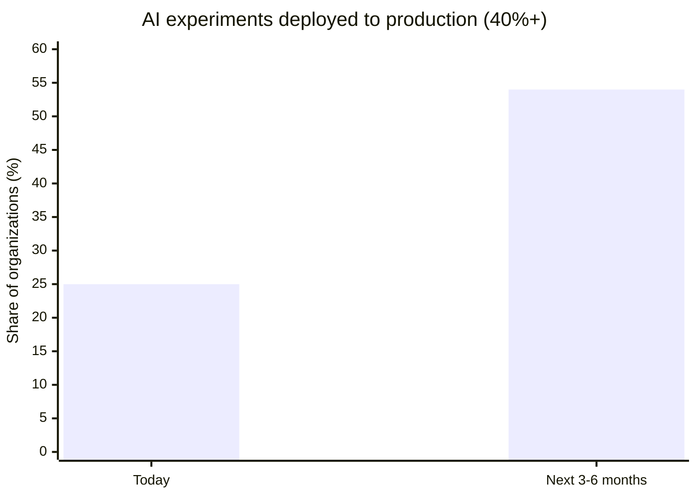
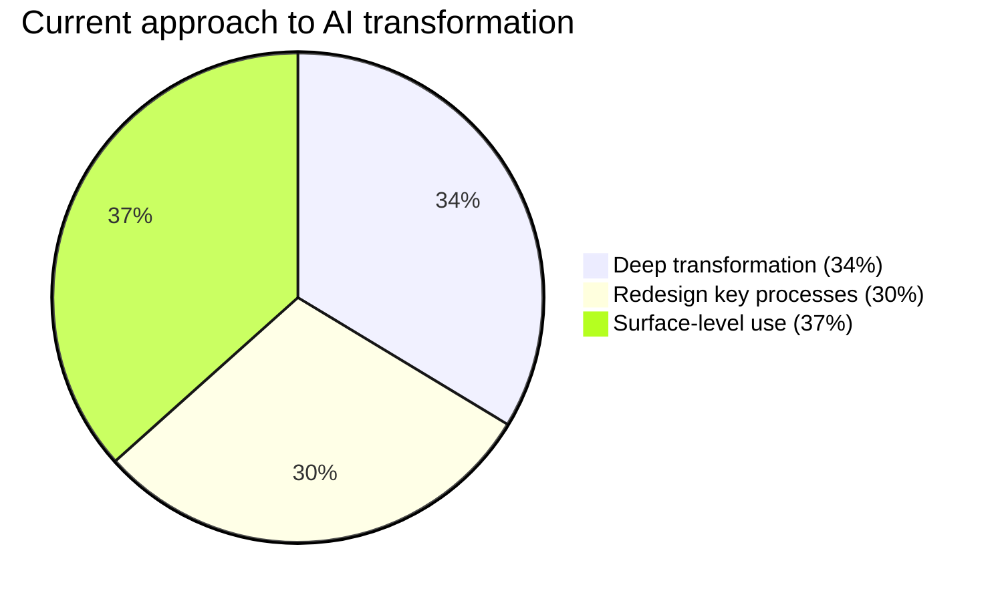
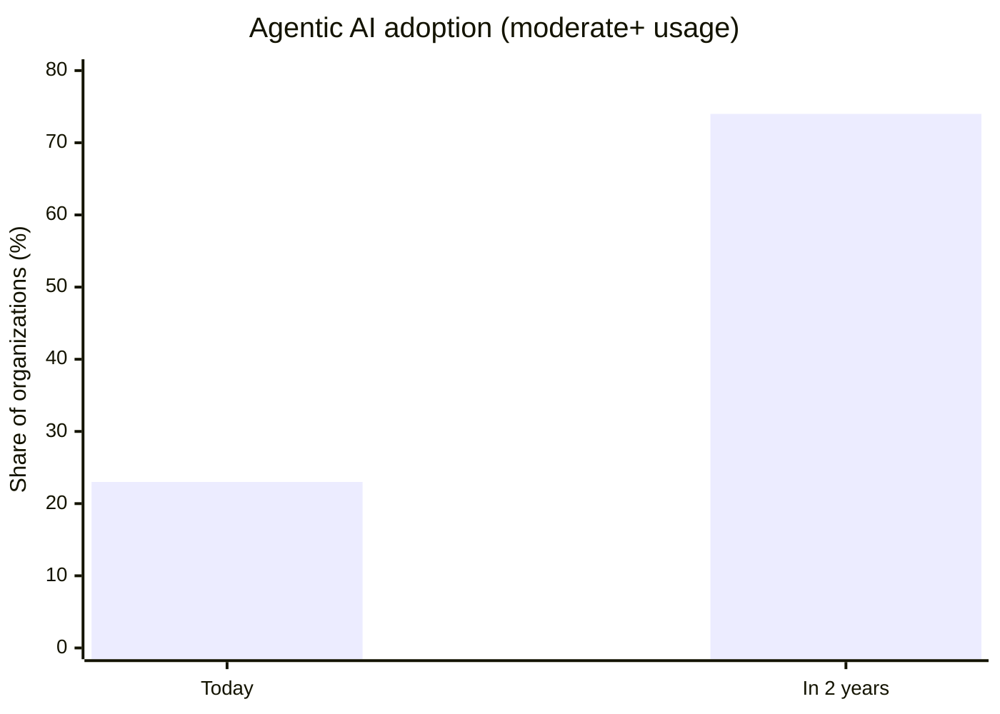
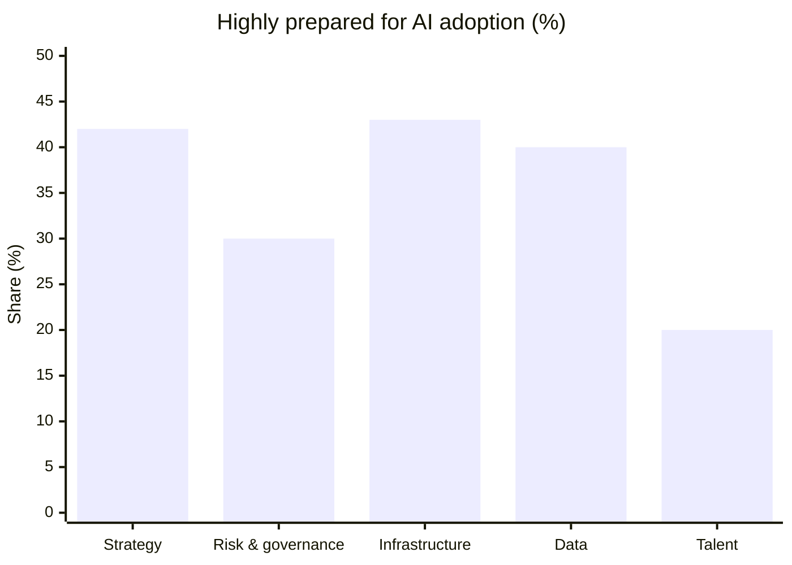
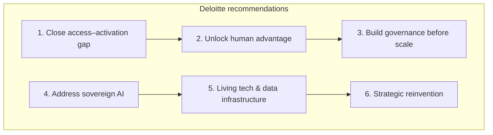

# State of AI in the Enterprise 2026 — Summary & Conclusion

**Source:** Deloitte AI Institute, *State of AI in the Enterprise: The untapped edge* (January 2026)  
**Methodology:** 3,235 director-to-C-suite leaders across 24 countries and 6 industries (Aug–Sep 2025), plus 15 executive interviews.  
**Full report:** [deloitte.com/us/state-of-ai](https://www.deloitte.com/us/en/what-we-do/capabilities/applied-artificial-intelligence/content/state-of-ai-in-the-enterprise.html)  
**Visual edition:** [state-of-ai-2026-summary.html](./state-of-ai-2026-summary.html)  
**Applied roadmap:** [IT Cloud Team Agentic AI roadmap](../roadmaps/it-cloud-team-ai-roadmap.md) (Agentic Enterprise 2028 + State of AI 2026)

---

## Executive summary

The report frames 2026 as a pivot from **AI experimentation to enterprise activation**. Momentum is real—access, investment, and confidence are all rising—but most organizations still capture only a fraction of AI's potential. The gap is not primarily about technology access; it is about **usage, scale, work redesign, governance, and strategic reinvention**.

---

## Key findings at a glance

| Theme | Headline stat | Implication |
| --- | --- | --- |
| Access vs. activation | Workforce access up ~50% YoY; daily usage unchanged | Tools are deployed; adoption lags |
| Pilot to production | 25% today → 54% expect scale in 3–6 months | Path is clear but execution is hard |
| Transformation depth | 34% deep / 30% process / 37% surface | Most optimize; few reinvent |
| Work redesign | 84% have not redesigned jobs around AI | Fluency without structural change |
| Sovereign AI | 77% factor country of origin into vendor choice | Geographic sovereignty = strategic |
| Agentic AI | 23% today → 74% in 2 years; 21% mature governance | Agents outpace guardrails |
| Physical AI | 58% today → 80% in 2 years | Slower than software; AP leads |
| Preparedness | 42% strategy-ready vs. 20% talent-ready | Strategy ahead of operations |

---

## 1. From pilots to production

| Metric | Finding |
| --- | --- |
| Workforce access to sanctioned AI tools | Up ~50% YoY: under 40% → ~60% of workers |
| Daily usage among those with access | Still under 60% (unchanged YoY) |
| AI experiments moved to production (40%+) | 25% today; **54% expect to reach this in 3–6 months** |

Organizations are stuck in a **proof-of-concept trap**. Pilots run in clean, isolated environments; production demands integration, security, compliance, monitoring, and maintenance. Without a coherent strategy, leaders risk **pilot fatigue**—many small experiments that never scale.

---

## 2. Productivity for most, reinvention for few

- **66%** already see efficiency/productivity gains; **20%** see revenue growth today vs. **74%** hoping for it.
- **25%** report AI is having a *transformative* effect on their company (up from 12% a year ago).

**Transformation depth:**

Most organizations optimize what exists; a minority reimagine the business.

---

## 3. AI fluency without work redesign

- **84%** have **not** redesigned jobs around AI capabilities.
- **36%** expect ≥10% of jobs fully automated within a year; **82%** within three years.
- **Insufficient worker skills** are the top barrier to integration.
- **53%** focus on AI fluency education; far fewer redesign roles, workflows, or career paths.
- **53%** have considered flatter/pod-based structures; only **16%** have adopted them meaningfully.

Worker sentiment is cautiously positive (68% enthusiastic or open), but skepticism persists (25% reluctant or distrustful).

---

## 4. Sovereign AI — where technology is built matters

- **83%** rate sovereign AI at least moderately important to strategic planning.
- **77%** factor an AI solution's **country of origin** into vendor decisions.
- **58%** build AI stacks primarily with local vendors.
- **66%** are at least moderately concerned about reliance on foreign-owned AI.

Sovereign AI is framed as **strategic independence**, not just data residency—especially acute for cross-border and state-run customers.

---

## 5. Agentic AI scaling faster than guardrails

| | Today | In 2 years |
| --- | --- | --- |
| Use agentic AI at least moderately | 23% | **74%** |

- **85%** expect to customize agents for their business.
- High-impact use cases: customer support, supply chain, R&D, knowledge management, cybersecurity.
- Only **21%** have a **mature governance model** for autonomous agents.

**Top AI risks:**

| Risk | Share concerned |
| --- | --- |
| Data privacy and security | 73% |
| Legal, IP, regulatory compliance | 50% |
| Governance capabilities and oversight | 46% |
| Model quality, consistency, explainability | 46% |

Agents act directly (purchases, communications, system changes)—requiring new boundaries, real-time monitoring, and audit trails beyond traditional AI oversight.

---

## 6. Physical AI — embedded and accelerating

- **58%** use physical AI today (at least limited); **80%** expect to within two years.
- Asia Pacific leads: **71%** today vs. 56% in Americas/EMEA; **90%** expected adoption in AP in two years.
- Adoption is slower than agentic AI due to capital costs, safety regulation, and hardware complexity.
- Highest expected impact: intelligent security/monitoring (21%), collaborative robotics (20%), digital twins (19%).
- Controlled environments (factories, warehouses) advance faster than open-world deployments.

---

## 7. Preparedness gap: strategy vs. operations

Leaders feel more ready on **strategy** (42% highly prepared) and **risk/governance** (30%) than on technical infrastructure (43%), data management (40%), and talent (20%).

Many organizations prepared for traditional AI; **80–90% of new use cases are now GenAI**, requiring different capabilities. Resolving priority AI challenges is expected to take **more than a year** for most respondents.

---

## Six focus areas to capture AI's untapped edge

1. **Close the access–activation gap** — Design for deployment from day one; grassroots adoption plus executive sponsorship.
2. **Unlock human advantage** — Redesign work, roles, and career paths holistically (not layer AI onto legacy processes).
3. **Build governance before scale** — Make oversight everyone's role; integrate with existing risk structures.
4. **Address sovereign AI with discipline** — Map data residency, compute location, and cross-border rules proactively.
5. **Build a "living" tech and data infrastructure** — Modular, cloud-native, real-time backbone for software and physical AI.
6. **Pursue strategic reinvention** — Treat AI as foundational to how the organization operates and competes, not just a cost tool.

---

## Conclusion

The central thesis of the report is **"the untapped edge"**: AI's transformational potential is real and accelerating, but **value is constrained by activation, not ambition**.

### What is working

- Broader tool access
- Rising investment (84% increasing spend)
- Growing confidence (78%)
- Early productivity wins
- A clear pathway from pilot to production for organizations that commit to scale

### What is not working

- Low daily usage despite access
- Persistent pilot-to-production friction
- Efficiency-first mindset over business model reinvention
- Talent strategies focused on fluency rather than structural change
- Governance lagging behind agentic AI adoption
- Operational readiness (infrastructure, data, talent) trailing strategic confidence

### The strategic divide

A widening gap separates organizations using AI for incremental efficiency from those embedding it into core operations, offerings, and governance. Winners will likely be those who:

- Move from **experimentation to operationalization**
- Redesign **how humans and AI work together**, not just automate tasks
- Establish **agent governance** before agents scale autonomously
- Treat **sovereign AI** as a competitiveness issue, not a compliance checkbox
- Modernize **data and infrastructure** for agentic and physical AI
- Pursue **reinvention** across multiple horizons (core ops, adjacent markets, new businesses)

### Bottom line

2026 is less about whether to adopt AI and more about **whether organizations can activate it at scale**—with the right work design, governance, infrastructure, and strategic intent. The technology edge is available; the competitive edge goes to those who turn access into adoption, pilots into production, and efficiency into enduring differentiation.

---

*This summary is derived from Deloitte's State of AI in the Enterprise report (January 2026). For the full report, methodology, and citations, see the [original publication](https://www.deloitte.com/us/en/what-we-do/capabilities/applied-artificial-intelligence/content/state-of-ai-in-the-enterprise.html).*
