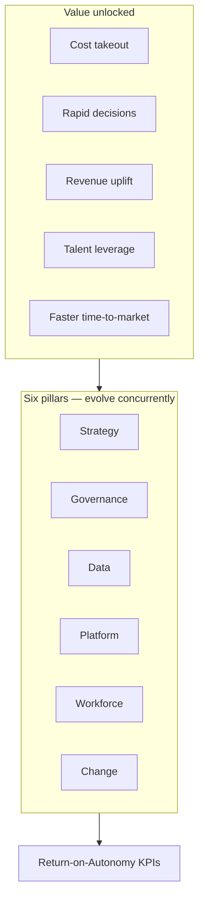
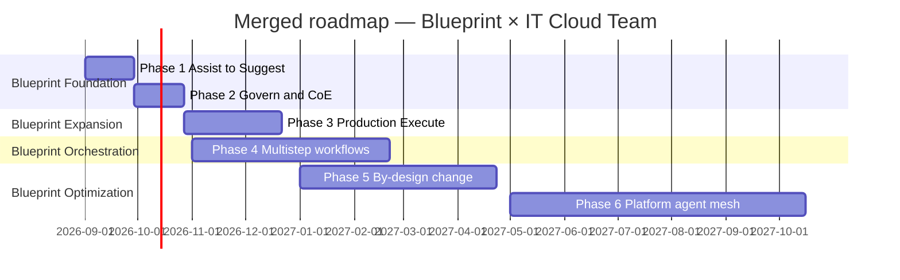
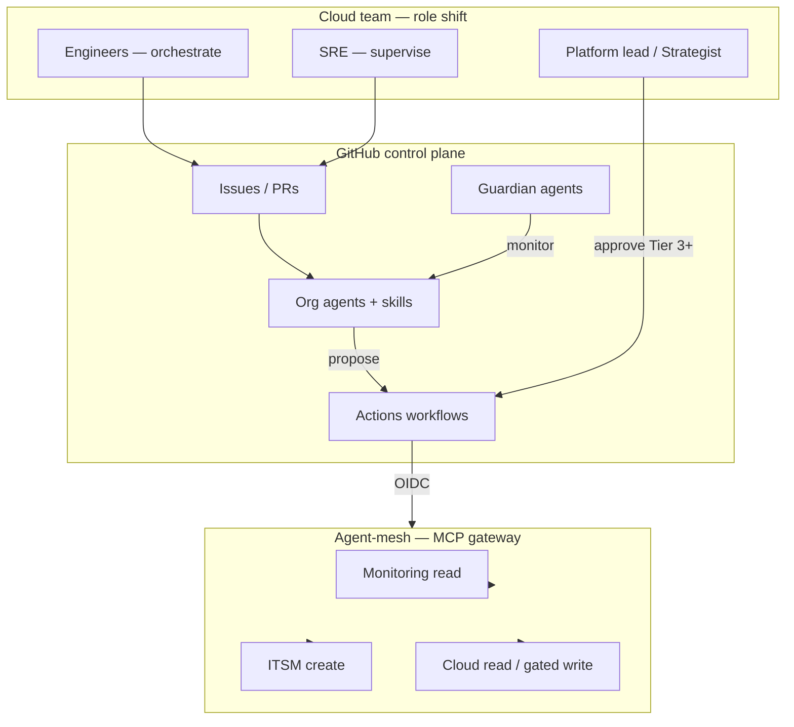

# Agentic Enterprise 2028 — Summary, Conclusion & IT Cloud Implementation Plan

**Status:** Draft for review  
**Audience:** IT leadership, IT Cloud / platform team, security, AI platform owner  
**Date:** 2026-09-01  
**Sources:** [Agentic enterprise 2028 (PDF)](../../images/agentic-ai-enterprise-2028.pdf) · [IT Cloud Team roadmap](./it-cloud-team-ai-roadmap.md) · [GitHub agentic IT control plane](../architecture/github-agentic-it-control-plane.md)

**Visual edition:** [agentic-enterprise-2028-it-cloud-implementation-plan.html](./agentic-enterprise-2028-it-cloud-implementation-plan.html)

---

## Part I — Executive summary (Agentic Enterprise 2028)

Deloitte's *Agentic enterprise 2028* frames agentic AI as the **operating logic of tomorrow's enterprise** — not smarter automation alone. Organizations that embrace autonomy by 2028 will likely reclaim operating costs, release products faster, and redeploy talent to higher-value work. Autonomy means empowering intelligent agents to sense their environment, make decisions, and act with minimal human oversight — at scale, when supplied with high-quality data and well-defined governance.

The benefits are substantial but matched by complexity. Realizing them requires climbing a **six-step autonomy ladder** grounded in replatforming technology, reskilling talent, revising risk management, and redesigning work. Deloitte's **Return-on-Autonomy (RoA)** dashboard gives leaders industry-agnostic KPIs to gauge impact, calibrate investment, and course-correct early.

| Theme | Headline | Implication |
| --- | --- | --- |
| Strategic shift | Agentic AI = operating logic, not smarter automation | Requires systemic transformation, not plug-in pilots |
| Why now | 77% of CEOs say AI shapes business; 2/3 say models aren't ready | Competitive clock is ticking |
| Tech momentum | Gartner: 1/3 of enterprise apps embed agents by 2028 | Platform shift is underway |
| Autonomy ladder | 6 maturity levels from Assist to Self-evolve | Phased journey, not binary rollout |
| 2028 outlook | Execute-level penetration: 25–30% today → 55–65% | Bounded autonomy scales first |
| Six pillars | Strategy, governance, data, platform, workforce, change | All dimensions must evolve concurrently |
| Workforce | Humans shift from operators to orchestrators | New roles emerge; skilled trades boom |
| Measurement | RoA KPIs across cost, speed, productivity, quality, trust | Prove value at process and portfolio level |

### Why now — three macro forces

| Force | Signal | Strategic response |
| --- | --- | --- |
| **Competitive pressure** | 77% of CEOs say AI will shape business; two-thirds concede their business model isn't ready | Move from experimentation to operating-model redesign |
| **Regulatory scrutiny** | EU AI Act and US executive orders codify obligations for high-risk AI | Turn compliance into differentiator via auditability |
| **Tech momentum** | Gartner: one-third of enterprise applications will embed autonomous agents by 2028 | Invest in platform, data, and integration patterns now |

### The autonomy ladder

| Level | Name | Human role | 2025 penetration | 2028 outlook |
| --- | --- | --- | --- | --- |
| 0 | **Assist** | Operator | 70–80%+ | 90–97% |
| 1 | **Suggest** | Guide | 50–60% | 75–85% |
| 2 | **Execute** | Monitor | 25–30% | 55–65% |
| 3 | **Orchestrate** | Supervisor | 8–10% | 25–35% |
| 4 | **Optimize** | Strategist | 2–3% | 10–18% |
| 5 | **Self-evolve** | Orchestrator | <1% | 5–10% |

*Penetration = at least one production-grade deployment at scale (not pilot/POC). 2028 outlook is scenario-based and illustrative.*

### Six pillars — autonomous operating system

1. **Adaptive strategy** — Overlay, as-a-service, and by-design integration patterns; Agentic CoE; layered rollout.
2. **Proactive risk, security, and governance** — Guardian agents; policy-as-code; tiered risk frameworks.
3. **Intelligent data ecosystem** — Convergence architecture; vectorized data fabric; human expertise capture.
4. **Scalable platform and tech enablement** — MCP, A2A, MAS; agent-mesh orchestration layer.
5. **Empowered workforce** — Operator → orchestrator; new agentic roles; human-AI pods.
6. **Ongoing change management** — Trust deficit (44% change readiness, down from 74%); stagility design.

### Blueprint implementation timeline (enterprise)

| Phase | Timeline | Level transition | Primary value unlock |
| --- | --- | --- | --- |
| **Foundation** | First 30 days | Assist → Suggest | AI proposes single-step options |
| **Pilot expansion** | First 90 days | Suggest → Execute | AI executes bounded tasks end-to-end |
| **Hybrid flows** | Next 180 days | Execute → Orchestrate | Multistep workflows with human exceptions |
| **By-design pilots** | By month 12 | Orchestrate → Optimize | Closed-loop optimization of value chains |
| **Enterprise network** | Years 2–3 | Optimize → Self-evolve | Self-improving agent mesh |

---

## Part II — Conclusion (Agentic Enterprise 2028)

### Act early, scale confidently

Agentic AI is not a singular rollout — it is a **phased transformation**, much like the shift from steam to electricity on the factory floor. Organizations that start now will likely do more than unlock incremental efficiency; they will create **adaptive operating models** that learn, self-optimize, and compound value over time.

### What early movers gain

- Reclaimed operating costs through accelerated processes and near-zero rework
- Faster time-to-market via autonomous mesh architectures
- Talent redeployed to orchestration, reliability, and strategic oversight
- Influence over regulations and industry standards
- Competitive barriers that challenge later entrants

### What holds organizations back

- Treating agents as plug-in features rather than operating-model change
- Scaling autonomy without proportional governance (guardian agents, policy-as-code)
- Fragmented data pipelines that agents inherit as weaknesses
- API-only integration that bottlenecks multi-agent orchestration
- Fluency programs without role redesign and dynamic talent pipelines
- Change management that ignores record-low trust and workforce stagility tensions

### Strategic questions for leaders

| Pillar | Question |
| --- | --- |
| **Strategy** | How can agentic autonomy reinforce core objectives, brand promise, and competitive advantage? |
| **Governance** | What controls and oversight mitigate risks from autonomous decisions? |
| **Data** | Do we have scalable pipelines and feedback loops to train, monitor, and improve agents? |
| **Platform** | Which MCP/A2A/MAS upgrades and orchestration capabilities are critical to scale? |
| **Workforce** | How should we reskill and engage talent to thrive alongside increasing autonomy? |

### Bottom line

Treat autonomy as a **staged journey with measurable milestones and cross-functional ownership**. Those who move first — methodically but decisively — are better positioned to capture outsized gains and define the playbook for the agentic enterprise era.

---

## Part III — Merged implementation plan (IT Cloud Team)

This section merges the Deloitte blueprint with the [IT Cloud Team Agentic AI roadmap](./it-cloud-team-ai-roadmap.md), aligned to the [GitHub-centered agentic IT control plane](../architecture/github-agentic-it-control-plane.md).

### Strategic intent

Move the cloud team from **Assist** (briefings, drafts) through **Execute** (bounded E2E tasks) and **Orchestrate** (multistep incident/change flows) toward **Optimize** (closed-loop platform operations) — with humans shifting from operators to orchestrators. Avoid the **proof-of-concept trap**: every pilot declares its production path, owner, integration pattern, and RoA metrics before funding.

### Blueprint → cloud team mapping

| Blueprint theme | Enterprise signal | Cloud team response | Phase |
| --- | --- | --- | --- |
| Operating logic, not automation | Agentic AI reshapes how work is performed | Climb autonomy ladder; redesign work in Phase 4+ | 1–6 |
| Why now | 77% CEOs; Gartner 1/3 apps with agents by 2028 | Start overlay pilots now; by-design in Phase 5–6 | 1 |
| Autonomy ladder | Execute 55–65% by 2028 | Map phases to levels 0→4; target Execute by Phase 3 | 1–6 |
| Integration patterns | Overlay → as-a-service → by design | Layered rollout; by-design for core change flows | 1–6 |
| Guardian agents | Supervisory agents monitor other agents | Policy-as-code + guardian agent pattern | 4 |
| Data convergence | Operational + analytical unified | Domain data products + MCP read APIs | 3–5 |
| MCP / A2A / agent-mesh | API-only bottlenecks multi-agent scale | Agent-mesh via MCP gateway | 5 |
| RoA KPIs | Cost, speed, productivity, quality, trust | Baseline Phase 1; quarterly review Phase 3+ | 1–6 |
| Workforce shift | Operator → orchestrator | Agentic CoE, new roles, human-AI pods | 2–4 |
| Change & trust | 44% willing to support change | Co-design guardrails; no silent prod mutation | 4 |

### Merged timeline — blueprint phases × cloud team phases

| Blueprint anchor | Cloud phase | Timing | Autonomy target | Integration pattern |
| --- | --- | --- | --- | --- |
| 30-day foundation | **Phase 1** | Weeks 1–4 | Assist → Suggest | Overlay + as-a-service |
| Governance pillar | **Phase 2** | Weeks 5–8 | Suggest (governed) | Overlay; CoE + policy-as-code |
| 90-day expansion | **Phase 3** | Weeks 9–16 | Suggest → Execute | Overlay pilots in production |
| 180-day orchestration | **Phase 4** | Months 5–8 | Execute → Orchestrate | Hybrid multistep flows |
| 12-month optimization | **Phase 5** | Months 9–12 | Orchestrate → Optimize | By-design change flows |
| Years 2–3 foundation | **Phase 6** | Months 13–18 | Optimize (platform mesh) | By-design platform catalog |

### Target operating model

**Principles:** Agents propose; workflows execute; humans own Tier 3+. No direct agent→cloud writes; gateway is the uniform, policy-driven interface.

---

## Part IV — Six-phase implementation plan

### Phase 1 — Assist → Suggest (weeks 1–4)

**Blueprint anchor:** 30-day foundation  
**Goal:** Universal sanctioned access, RoA baseline, Agentic CoE charter, two overlay pilots.

| Deliverable | Owner | Pillar |
| --- | --- | --- |
| Appoint **AI Platform Owner** and agent/skill owners (RACI) | IT leadership | Strategy |
| Confirm Copilot / enterprise AI licensing and IDE policy | AI Platform Owner | Strategy |
| Publish **approved / prohibited** use cases for cloud team | AI Platform Owner + Security | Governance |
| Select **2 overlay pilots** (Daily Ops + Intake) with RoA metrics | Platform lead | Strategy |
| **RoA baseline:** cost, speed, productivity, quality, trust | Platform lead | Strategy |
| **Sovereign cloud map** v0: regions, data classes, model endpoints | Cloud architect | Governance |

**Exit criteria:** 100% sanctioned AI access; RoA baseline captured; two pilots chartered; Agentic CoE charter drafted.

---

### Phase 2 — Govern & platform (weeks 5–8)

**Blueprint anchor:** Governance pillar  
**Goal:** GitHub control plane, agent governance, policy-as-code — **before** scaling to Execute.

| Deliverable | Owner | Pillar |
| --- | --- | --- |
| `.github-private` with agent templates, policies, CODEOWNERS | AI Platform Owner | Governance |
| Lean `agentic-it-platform` repo (workflows + eval stubs) | Cloud Platform Team | Platform |
| Org rulesets, secret scanning, audit export to SIEM | Security + Cloud Platform | Governance |
| OIDC trust for cloud (read-only roles first) | Cloud Platform Team | Platform |
| **Agent inventory** + risk tier model (Tiers 0–4) | AI Platform Owner | Governance |
| **Policy-as-code** v1: tier rules in CI | Security | Governance |
| **Agentic CoE** operational: portfolio scoring | AI Platform Owner | Strategy |

**Exit criteria:** Agent profile changes require PR + review; policy-as-code enforced; CoE prioritizing use cases.

---

### Phase 3 — Suggest → Execute (weeks 9–16)

**Blueprint anchor:** 90-day expansion  
**Goal:** First agents completing **bounded tasks end-to-end** in daily use.

| Deliverable | Owner | Pillar |
| --- | --- | --- |
| **IT Intake**, **Daily Operations**, **Knowledge Curator** at Execute level | Agent owners | Strategy |
| Starter skills: classify, summarize, find-runbook, draft-update | Skill owners | Platform |
| Read-only GitHub + monitoring/catalog MCP integrations | Cloud Platform | Data + Platform |
| **Convergence data products** v1: incident + deployment events | Cloud Platform | Data |
| Evaluation suite v1: permission boundaries, injection, refusal | AI Platform Owner | Governance |
| **RoA dashboard** v1: autonomy rate, first-pass yield, agent reliability | Platform lead | Strategy |

**Exit criteria:** ≥70% pilot squad uses agents weekly; ≥60% Daily Ops briefings accepted; one Tier 0–1 workflow E2E; zero unauthorized tool calls in evals.

---

### Phase 4 — Execute → Orchestrate (months 5–8)

**Blueprint anchor:** 180-day orchestration  
**Goal:** Multistep incident and change workflows; guardian agents; work redesign.

| Deliverable | Owner | Pillar |
| --- | --- | --- |
| **Incident Assistant** — triage → context → draft containment | SRE lead | Strategy |
| **Guardian agent** v1 — monitors operational agents, audit trail | AI Platform Owner | Governance |
| ITSM create-ticket workflow; chat notifications | Cloud Platform | Platform |
| Cost / FinOps read integration | FinOps + Platform | Data |
| **Human-AI pod** pilot: one platform service end-to-end | Platform lead | Workforce |
| Co-design guardrail sprints with frontline engineers | Platform lead | Change |

**Exit criteria:** Incident context pack in ≥80% Sev2+ incidents; guardian audit summary; pod retrospective completed.

---

### Phase 5 — Orchestrate → Optimize (months 9–12)

**Blueprint anchor:** 12-month optimization  
**Goal:** By-design change flows; closed-loop optimization.

| Deliverable | Owner | Pillar |
| --- | --- | --- |
| **Cloud Change Planner** — orchestrated PR + plan + rollback | Cloud Platform | Strategy |
| **MCP gateway** with narrow cloud tools; agent-mesh orchestration | Cloud Platform | Platform |
| Protected environments for production workflows | Cloud Platform | Platform |
| **Vector data fabric** for runbooks and architecture docs | Cloud Platform | Data |
| RoA review Q2: reallocate funding based on autonomy rate and trust | Platform lead | Strategy |

**Exit criteria:** All production changes via PR + environment approval + OIDC; autonomy rate measurable for ≥2 core workflows.

---

### Phase 6 — Optimize → platform mesh (months 13–18)

**Blueprint anchor:** Years 2–3 foundation  
**Goal:** Internal **cloud AI platform** as by-design product; foundation for Self-evolve.

| Deliverable | Owner | Pillar |
| --- | --- | --- |
| Self-service **agent catalog**: agents + skills + workflows for app teams | AI Platform Owner | Strategy |
| Multi-agent platform workflows (intake → change → knowledge) | Cloud Platform | Platform |
| Advanced evals: regression, cost/latency SLOs, quarterly recertification | AI Platform Owner | Governance |
| FinOps + capacity **Optimize** agents (advisory loops) | FinOps | Data |
| Executive **RoA dashboard** | Platform lead | Strategy |
| **Reinvention review**; roadmap v2 | IT leadership | Strategy |

**Exit criteria:** ≥2 consuming teams outside cloud platform; documented outcomes beyond efficiency; roadmap v2 published.

---

## Part V — Autonomy use cases & RoA metrics

### Cloud team use cases by autonomy level

| Level | Cloud use case | Agent / skill | Tier | Phase |
| --- | --- | --- | --- | --- |
| 0 Assist | Log explainer, FAQ chatbot | Knowledge Curator (read) | 0 | 1–3 |
| 1 Suggest | Daily briefing, plan "what-if" | Daily Ops, plan summary | 0–1 | 1–3 |
| 2 Execute | End-to-end intake enrichment | IT Intake, Knowledge Curator | 1–2 | 3–4 |
| 3 Orchestrate | Incident triage → containment playbook | Incident Assistant | 2 | 4–5 |
| 4 Optimize | Change PR + plan + rollback; capacity optimization | Cloud Change Planner + guardian | 2–3 | 5–6 |
| 5 Self-evolve | Adaptive FinOps/capacity mesh (aspirational) | Platform agent mesh | 3+ | Roadmap v2 |

### Return-on-Autonomy (RoA) — cloud team targets

| Dimension | Cloud team target (Phase 6) |
| --- | --- |
| **Cost** | −10% ops overhead on pilot services |
| **Speed** | −20% change lead time |
| **Productivity** | ≥30% routine tasks at Execute+ |
| **Quality** | No increase in deployment failures |
| **Trust** | ≥90% workflows without escalation |

| Metric | Baseline (Phase 1) | Target (Phase 3) | Target (Phase 6) |
| --- | --- | --- | --- |
| Weekly active users (% cloud team) | Measure | ≥70% | ≥85% |
| Tasks via agent/workflow per week | 0 | ≥5 per active user | ≥10 |
| Pilots with production path + autonomy level | 0% | 100% | 100% |

---

## Part VI — Dependencies, risks & next steps

### Key dependencies

| Dependency | Risk if missing | Mitigation |
| --- | --- | --- |
| GitHub Enterprise + Copilot licensing | No org agents, thin audit | Phase 1 decision |
| Security sign-off on MCP gateway | Pilots stay GitHub-only | Scope Phase 3 read-only; gateway in Phase 5 |
| Named agent owners + CoE | Orphan agents, portfolio drift | RACI + CoE scoring in Phase 2 |
| Convergence data products | Weak agent context | Prioritize in Phase 3 |

### Top risks

| Risk | Response |
| --- | --- |
| Agents as plug-ins, not operating-model change | Autonomy ladder mapping; work redesign in Phase 4 |
| Autonomy scaling without guardian agents | Guardian agent in Phase 4; no Orchestrate+ without it |
| Pilot fatigue | Max 2 pilots until Phase 3 exit; CoE prioritization |
| Trust deficit / change resistance | Co-design guardrails; transparent limitations |

### Immediate next steps

1. Review Phase 1 with IT leadership and security
2. Name **AI Platform Owner**
3. Charter **Agentic CoE**
4. Launch two overlay pilots with RoA baseline and autonomy level targets
5. Map **sovereign cloud** v0

---

## Related documents

- [Agentic enterprise 2028 — summary](../reports/agentic-ai-enterprise-2028-summary.md)
- [IT Cloud Team — Agentic AI roadmap](./it-cloud-team-ai-roadmap.md)
- [GitHub-centered agentic IT control plane](../architecture/github-agentic-it-control-plane.md)
- [ADR 001 — GitHub as control plane](../decisions/001-github-as-control-plane.md)
- [ADR 002 — Agent / skill / workflow split](../decisions/002-agent-skill-workflow-split.md)

---

*Summary derived from Deloitte's Agentic enterprise 2028 (September 2025). Implementation plan merged with IT Cloud Team roadmap. For the full report see [agentic-ai-enterprise-2028.pdf](../../images/agentic-ai-enterprise-2028.pdf) or the [Deloitte AI Institute](https://www.deloitte.com/us/AIInstitute).*
