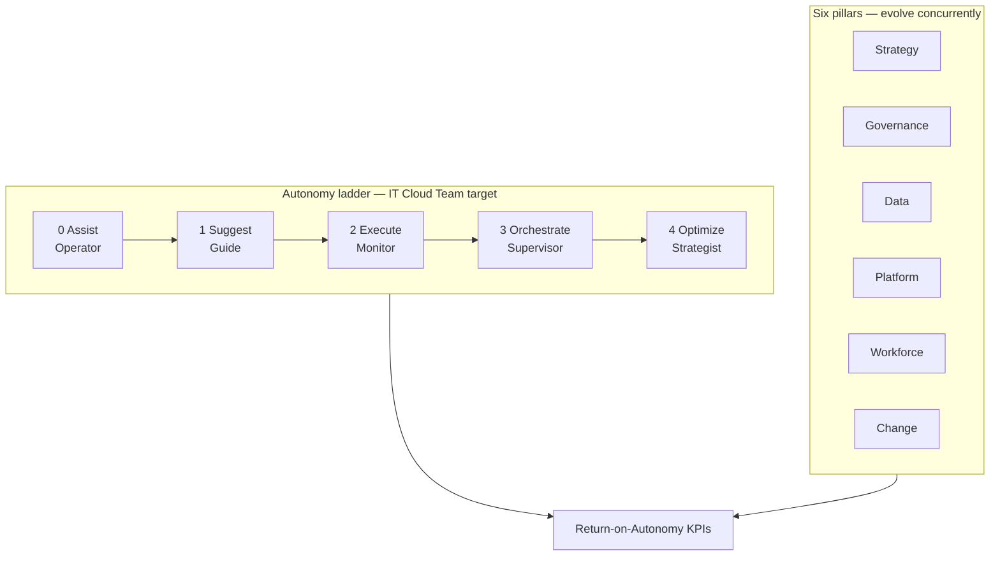
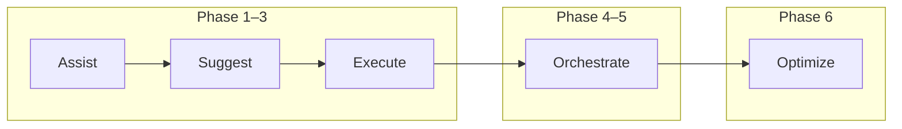
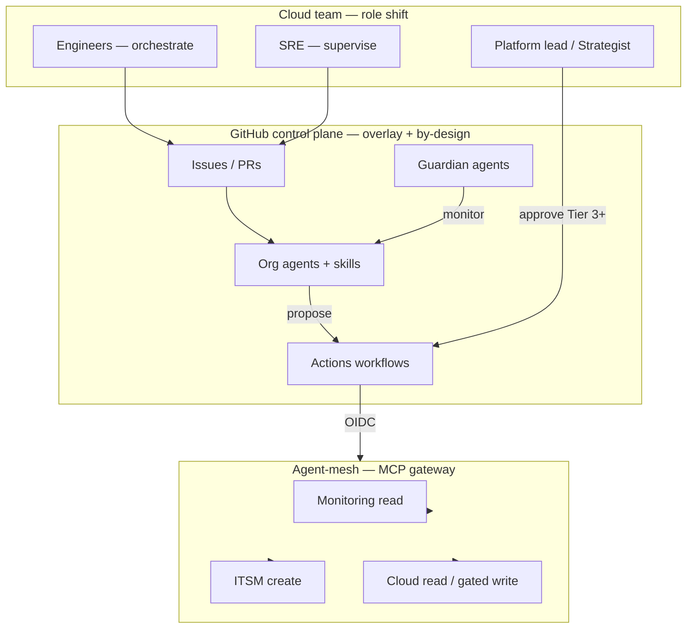
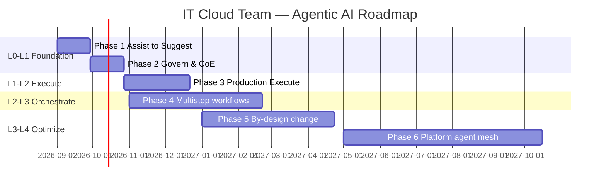

# IT Cloud Team — Agentic AI Roadmap

**Status:** Draft for review  
**Audience:** IT Cloud / platform team, security, AI platform owner, service owners  
**Date:** 2026-09-01  
**Basis:** [Agentic enterprise 2028](../reports/agentic-ai-enterprise-2028-summary.md) applied to cloud platform operations, complemented by [State of AI 2026](../reports/state-of-ai-2026-summary.md), aligned with [GitHub-centered agentic IT control plane](../architecture/github-agentic-it-control-plane.md)

**Visual edition:** [it-cloud-team-ai-roadmap.html](./it-cloud-team-ai-roadmap.html)  
**GitHub Organization implementation:** [NL ITS Cloud Copilot marketplace](./nl-its-cloud-copilot-marketplace.md) — `Deloitte-Netherlands/nl-its-cloud-ai-marketplace`  
**Merged plan (summary + conclusion + roadmap):** [agentic-enterprise-2028-it-cloud-implementation-plan.md](./agentic-enterprise-2028-it-cloud-implementation-plan.md)

---

## 1. Executive summary

Deloitte's *Agentic enterprise 2028* frames agentic AI as the **operating logic** of tomorrow's enterprise — not smarter automation alone. For an IT Cloud Team, that means climbing the **autonomy ladder** (Assist → Self-evolve) while evolving six pillars concurrently: strategy, governance, data, platform, workforce, and change management.

Today's gap is familiar: Copilot licenses without production agent workflows; Terraform drafts in chat without a gated deploy path; agent experiments that never pass security review. The State of AI 2026 report confirms the pattern — access outpaces activation, governance, and work redesign.

This roadmap applies the Agentic Enterprise blueprint to cloud platform work and sequences delivery in **six phases over 18 months**, mapped to autonomy levels 0–4 (Optimize) with a path toward level 5. It deliberately avoids the **proof-of-concept trap** by requiring every pilot to declare its production path, owner, integration pattern, and RoA metrics before funding.

**Strategic intent:** Move the cloud team from **Assist** (briefings, drafts) through **Execute** (bounded E2E tasks) and **Orchestrate** (multistep incident/change flows) toward **Optimize** (closed-loop platform operations) — with humans shifting from operators to orchestrators.

---

## 2. Agentic Enterprise 2028 — what it means for the cloud team

| Blueprint theme | Enterprise signal | Cloud team interpretation | Our response |
| --- | --- | --- | --- |
| Operating logic, not automation | Agentic AI reshapes how work is performed | Cloud ops still ticket → script → PR without agent orchestration | Climb autonomy ladder; redesign work in Phase 4+ |
| Why now | 77% CEOs say AI shapes business; Gartner: 1/3 apps with agents by 2028 | Platform shift is underway; late movers lose standard-setting | Start overlay pilots now; plan by-design in Phase 5–6 |
| Autonomy ladder | Execute: 25–30% today → 55–65% by 2028 | Most cloud teams are Assist/Suggest; few at Orchestrate | Map phases to levels 0→4; target Execute by Phase 3 |
| Integration patterns | Overlay → as-a-service → by design | GitHub agents are overlay; SaaS Copilot is as-a-service | Layered rollout per §6; by-design for core change flows |
| Guardian agents | Supervisory agents monitor other agents | No scalable oversight for multi-agent cloud workflows yet | Policy-as-code + guardian agent pattern in Phase 4 |
| Data convergence | Operational + analytical unified; vector fabric | Monitoring, CMDB, cost data fragmented | Domain data products + MCP read APIs (Phase 3–5) |
| MCP / A2A / agent-mesh | API-only bottlenecks multi-agent scale | Direct agent→cloud forbidden; gateway required | Agent-mesh orchestration layer via MCP gateway |
| RoA KPIs | Cost, speed, productivity, quality, trust | Cloud team tracks MTTR but not autonomy rate or agent reliability | Adopt RoA dashboard in Phase 1; review quarterly |
| Workforce shift | Operator → orchestrator; new roles emerge | 84% no job redesign (State of AI); fluency without structure | Agentic CoE, new roles, human-AI pods (Phase 2–4) |
| Change & trust | 44% willing to support change (down from 74%) | Engineers skeptical of autonomous cloud writes | Co-design guardrails with workforce; no silent prod mutation |

---

## 3. Six pillars applied to the cloud team

The blueprint requires all six pillars to evolve **concurrently** — not as sequential silos.

### 3.1 Adaptive strategy

Three integration patterns for cloud platform agents:

| Pattern | Cloud team application | Phase |
| --- | --- | --- |
| **Agents overlay** | Daily briefing, intake enrichment, plan summary on existing GitHub/ITSM flows | 1–3 |
| **Agents as-a-service** | Copilot, enterprise IDE agents, SaaS-embedded analytics | 1–ongoing |
| **Agents by design** | Incident → change → deploy as agent-orchestrated value chain; platform catalog as agent mesh | 5–6 |

Actions: multidimensional readiness assessment (Phase 1), layered rollout, dynamic use-case scoring, **Agentic Center of Excellence (CoE)** chartered in Phase 2.

Horizon sequencing:

- Horizon 1 (0–6 mo): Efficiency — overlay pilots (Assist/Suggest).
- Horizon 2 (6–12 mo): Integration — Execute/Orchestrate in daily ops.
- Horizon 3 (12–18 mo): Differentiation — by-design platform-as-product.

### 3.2 Proactive risk, security, and governance

Align with [ADR 002](../decisions/002-agent-skill-workflow-split.md): agents propose; workflows execute; humans own Tier 3+.

| Risk level | Cloud example | Autonomy | Controls |
| --- | --- | --- | --- |
| **Low** | Runbook draft, plan summary | Pre-defined, repeatable | Tier 0–1; read-only tools |
| **Medium** | ITSM ticket create, incident context pack | Semi-autonomous + checkpoints | Tier 2; workflow gates |
| **High** | Production deploy, IAM change | Fully gated; guardian oversight | Tier 3+; human + environment approval |

**Guardian agents:** Introduce supervisory agents that monitor, validate, and audit operational agents (Phase 4). **Policy-as-code:** Embed risk and compliance rules in agent configs and CI (Phase 2–5).

Target: Mature agent governance **before** any autonomous cloud write tool in production.

### 3.3 Intelligent data ecosystem

- **Convergence architecture:** Unify operational signals (monitoring, deployments, incidents) with analytical data (cost, capacity, trends) on accessible platforms.
- **Vectorized data fabric:** Runbooks, postmortems, architecture docs indexed for context-rich agent retrieval (Phase 3+).
- **Human expertise capture:** SRE and architect tacit knowledge encoded in skills, eval golden cases, and curated knowledge PRs — not lost to turnover.
- **Agent data access:** Structured catalog, incident history, cost telemetry via MCP gateway — no ad-hoc screen scraping.

### 3.4 Scalable platform and tech enablement

Evolve from API point integrations to **MCP-enabled, A2A-friendly, MAS-powered** architecture:

- **Phase 2–3:** GitHub control plane, OIDC, read-only cloud/monitoring APIs.
- **Phase 4–5:** MCP gateway with narrow cloud tools; agent-mesh orchestration for incident + change agents.
- **Phase 6:** Self-service agent catalog; multi-agent workflows for platform consumers.

Traditional API-only paths create bottlenecks; the gateway is the uniform, policy-driven interface for agent fleets.

### 3.5 Empowered workforce

Cloud team work types and agent impact:

| Work type | Agent impact | Human shift (18 months) |
| --- | --- | --- |
| **Tech — rote/structured** | High automation (config boilerplate, test cases) | System design, orchestration, governance |
| **Tech — domain/complex** | Selective (IaC draft, plan analysis) | Lead judgment; agents as co-analysts |
| **Ops — general** | High (alert triage, intake, scheduling) | Exception handling, customer experience |
| **Ops — specialist** | Augmented (diagnostics, safety checks) | Complex judgment, safety-critical tasks |

**New or evolved roles** (blueprint-aligned):

| Domain | Roles |
| --- | --- |
| Strategy | Agentic Process Architect, AI Business Translator, Value-Stream Product Owner |
| Engineering | Multi-agent Systems Engineer, Autonomous Reliability Engineer, Continuous-Learning Steward |
| Trust | Autonomy Auditor, Trust Lead, Agentic Risk & Compliance Partner |
| Adoption | Human-AI Interaction Coach, Human Escalation Officer |

**Human-AI pod** (Phase 4+): Small pod per platform domain — lead, 2–3 engineers, shared agents, shared on-call.

### 3.6 Ongoing change management

- Co-design guardrails with engineers — when agents act autonomously vs. seek confirmation.
- Address trust deficit: transparent agent limitations, escalation paths, no silent prod mutation.
- **Stagility:** Workers crave stability (75%); leaders demand agility (85%) — design for both.
- Brand/community: Automated change communications and customer-facing ops touchpoints reflect on IT reputation.

---

## 4. Autonomy ladder — cloud team use cases

Use cases mapped to autonomy levels and [control-plane risk tiers](../architecture/github-agentic-it-control-plane.md#6-risk-model-and-default-deny-policy).

| Level | Name | Human role | Cloud use case | Agent / skill | Tier | Target phase |
| --- | --- | --- | --- | --- | --- | --- |
| 0 | **Assist** | Operator | Log/metric explainer, FAQ chatbot | Knowledge Curator (read) | 0 | 1–3 |
| 1 | **Suggest** | Guide | Cross-skill prompt, plan "what-if", patch priority | Daily Ops, plan summary skill | 0–1 | 1–3 |
| 2 | **Execute** | Monitor | End-to-end intake enrichment, refund-style ticket flow, test-case generation | IT Intake, Knowledge Curator | 1–2 | 3–4 |
| 3 | **Orchestrate** | Supervisor | Incident triage → context → containment playbook; change record → PR draft | Incident Assistant, Change Planner | 2 | 4–5 |
| 4 | **Optimize** | Strategist | Month-end capacity optimization; self-healing patch pipeline with drift checks | Cloud Change Planner + guardian | 2–3 | 5–6 |
| 5 | **Self-evolve** | Orchestrator | Adaptive FinOps/capacity mesh (aspirational post-18 mo) | Platform agent mesh | 3+ | Roadmap v2 |

**Explicit prohibitions** (unchanged): no autonomous IAM escalation, production deletion, financial approval, or direct deploy without human + environment gates.

---

## 5. Target operating model

**Daily rhythm**

- **Start of day:** Daily Operations Agent briefing (Suggest) → lead confirms priorities.
- **Work intake:** Issues/forms → Intake Agent enriches end-to-end (Execute) → assign human or agent research.
- **Change:** Cloud Change Planner drafts PR/plan (Orchestrate) → human review → approved workflow deploys.
- **Incident:** Monitoring links issue → Incident Assistant orchestrates timeline (Orchestrate) → commander decides → gated remediation.
- **End of day:** Guardian agent audit summary → Knowledge Curator proposes doc updates.

---

## 6. Phased roadmap

### Overview — mapped to autonomy ladder and blueprint timeline

| Phase | Timing | Autonomy target | Integration pattern | Blueprint anchor |
| --- | --- | --- | --- | --- |
| **1** | Weeks 1–4 | Assist → Suggest | Overlay + as-a-service | 30-day foundation |
| **2** | Weeks 5–8 | Suggest (governed) | Overlay; CoE + policy-as-code | Governance pillar |
| **3** | Weeks 9–16 | Suggest → Execute | Overlay pilots in production | 90-day expansion |
| **4** | Months 5–8 | Execute → Orchestrate | Hybrid multistep flows | 180-day orchestration |
| **5** | Months 9–12 | Orchestrate → Optimize | By-design change flows | 12-month optimization |
| **6** | Months 13–18 | Optimize (platform mesh) | By-design platform catalog | Years 2–3 foundation |

---

### Phase 1 — Assist → Suggest (weeks 1–4)

**Goal:** Universal sanctioned access, RoA baseline, Agentic CoE charter, two overlay pilots — blueprint 30-day foundation.

| Deliverable | Owner | Pillar |
| --- | --- | --- |
| Appoint **AI Platform Owner** and agent/skill owners (RACI) | IT leadership | Strategy |
| Confirm Copilot / enterprise AI licensing and IDE policy | AI Platform Owner | Strategy |
| Publish **approved / prohibited** use cases for cloud team | AI Platform Owner + Security | Governance |
| Select **2 overlay pilots** (Daily Ops + Intake) with RoA metrics | Platform lead | Strategy |
| **RoA baseline:** cost, speed, productivity, quality, trust | Platform lead | Strategy |
| **Sovereign cloud map** v0: regions, data classes, model endpoints | Cloud architect | Governance |
| Readiness assessment: overlay vs. by-design per domain | AI Platform Owner | Strategy |

**Exit criteria**

- 100% cloud team has sanctioned AI access.
- RoA baseline captured; quarterly review cadence set.
- Two pilots chartered: production path, owner, eval plan, target autonomy level.
- Agentic CoE charter drafted.

---

### Phase 2 — Govern & platform (weeks 5–8)

**Goal:** GitHub control plane, agent governance, policy-as-code foundation — **before** scaling to Execute.

| Deliverable | Owner | Pillar |
| --- | --- | --- |
| `.github-private` with agent templates, policies, CODEOWNERS | AI Platform Owner | Governance |
| Lean `agentic-it-platform` repo (workflows + eval stubs) | Cloud Platform Team | Platform |
| Org rulesets, secret scanning, audit export to SIEM | Security + Cloud Platform | Governance |
| OIDC trust for cloud (read-only roles first) | Cloud Platform Team | Platform |
| **Agent inventory** + risk tier model (Tiers 0–4) + use-case risk levels | AI Platform Owner | Governance |
| **Policy-as-code** v1: tier rules in CI | Security | Governance |
| Emergency-disable runbook (tested) | Security | Governance |
| **Agentic CoE** operational: portfolio scoring, success measures | AI Platform Owner | Strategy |
| Sovereign cloud map v1 signed by compliance | Cloud architect | Governance |

**Exit criteria**

- Agent profile changes require PR + review.
- Policy-as-code enforced for tier boundaries.
- CoE prioritizing use cases by scalability and interoperability.
- Governance framework documented (guardrails, monitoring, audit).

---

### Phase 3 — Suggest → Execute (weeks 9–16)

**Goal:** First agents completing **bounded tasks end-to-end** in daily use — blueprint 90-day expansion.

| Deliverable | Owner | Pillar |
| --- | --- | --- |
| **IT Intake**, **Daily Operations**, **Knowledge Curator** at Execute level | Agent owners | Strategy |
| Starter skills: classify, summarize, find-runbook, draft-update | Skill owners | Platform |
| Read-only GitHub + monitoring/catalog MCP integrations | Cloud Platform | Data + Platform |
| **Convergence data products** v1: incident + deployment events | Cloud Platform | Data |
| Evaluation suite v1: permission boundaries, injection, refusal | AI Platform Owner | Governance |
| **RoA dashboard** v1: autonomy rate, first-pass yield, agent reliability | Platform lead | Strategy |

**Exit criteria**

- ≥70% of pilot squad uses agents weekly.
- ≥60% of Daily Ops briefings accepted with minor edits.
- At least one workflow completes end-to-end without human confirmation (Tier 0–1).
- Zero unauthorized tool calls in evals.
- Measurable time reduction on intake/summarization (target: 20%+).

---

### Phase 4 — Execute → Orchestrate (months 5–8)

**Goal:** Multistep incident and change workflows; guardian agents; work redesign — blueprint 180-day orchestration.

| Deliverable | Owner | Pillar |
| --- | --- | --- |
| **Incident Assistant** — triage → context → draft containment | SRE lead | Strategy |
| **Guardian agent** v1 — monitors operational agents, audit trail | AI Platform Owner | Governance |
| ITSM create-ticket workflow; chat notifications (restricted publish) | Cloud Platform | Platform |
| Cost / FinOps read integration | FinOps + Platform | Data |
| **Human-AI pod** pilot: one platform service end-to-end | Platform lead | Workforce |
| New roles pilot: Autonomy Auditor, Human-AI Interaction Coach | HR + Platform lead | Workforce |
| Co-design guardrail sprints with frontline engineers | Platform lead | Change |
| Agent governance **mature model** assessment | Security + AI Platform | Governance |

**Exit criteria**

- Incident context pack used in ≥80% of Sev2+ incidents in pilot scope.
- Guardian agent produces audit summary for monitored workflows.
- Pod model retrospective completed; role definitions refined.
- Governance assessment gaps have remediation owners and dates.

---

### Phase 5 — Orchestrate → Optimize (months 9–12)

**Goal:** By-design change flows; closed-loop optimization — blueprint 12-month target.

| Deliverable | Owner | Pillar |
| --- | --- | --- |
| **Cloud Change Planner** — orchestrated PR + plan + rollback (by-design pilot) | Cloud Platform | Strategy |
| **MCP gateway** with narrow cloud tools; agent-mesh orchestration layer | Cloud Platform | Platform |
| Protected environments for production workflows | Cloud Platform | Platform |
| Policy-as-code checks in CI (expanded) | Security | Governance |
| Post-deploy verification and rollback workflows | SRE | Platform |
| **Vector data fabric** for runbooks and architecture docs | Cloud Platform | Data |
| RoA review Q2: reallocate funding based on autonomy rate and trust KPIs | Platform lead | Strategy |

**Exit criteria**

- All production changes via PR + environment approval + OIDC.
- Cloud Change Planner meets merge quality bar (≥50% PRs merged with minor edits).
- No direct agent deploy path; workflows + guardian oversight only.
- Autonomy rate measurable for ≥2 core workflows.

---

### Phase 6 — Optimize → platform mesh (months 13–18)

**Goal:** Internal **cloud AI platform** as by-design product; Optimize-level operations — foundation for Self-evolve.

| Deliverable | Owner | Pillar |
| --- | --- | --- |
| Self-service **agent catalog**: agents + skills + workflows for app teams | AI Platform Owner | Strategy |
| Multi-agent platform workflows (intake → change → knowledge) | Cloud Platform | Platform |
| Advanced evals: regression, cost/latency SLOs, quarterly recertification | AI Platform Owner | Governance |
| FinOps + capacity **Optimize** agents (advisory + recommendation loops) | FinOps | Data |
| Executive **RoA dashboard**: cost, speed, productivity, quality, trust | Platform lead | Strategy |
| **Reinvention review**: platform pricing, partner SLAs, roadmap v2 | IT leadership | Strategy |
| Dynamic talent pipeline: 6/12/24-month role forecast | HR + Platform lead | Workforce |

**Exit criteria**

- ≥2 consuming teams outside cloud platform using approved agents/workflows.
- Documented outcomes beyond efficiency (change throughput, audit posture, autonomy rate).
- Roadmap v2 published; Self-evolve candidates identified.

---

## 7. Work and talent plan

Blueprint: fluency alone is insufficient — pair training with role redesign and new agentic roles.

| Activity | When | Audience |
| --- | --- | --- |
| AI fluency (prompting, review, refusal) | Phase 1–ongoing | All engineers |
| Agent owner training (evals, instructions, incident response) | Phase 2 | Agent owners |
| Workflow authoring (Actions, OIDC, environments) | Phase 2–3 | Cloud Platform |
| Guardian agent and policy-as-code concepts | Phase 4 | Agent owners + Security |
| Human-AI orchestration (override, explain decisions) | Phase 4 | SRE + leads |
| Agentic role pathways (Architect, Auditor, Coach) | Phase 4–6 | All + HR |

**Integration pattern readiness** (when to choose overlay vs. by-design):

| Signal | Overlay / as-a-service | By design |
| --- | --- | --- |
| Process clarity | Partially defined | All steps mapped |
| Data readiness | Moderately connected | Robust data fabric |
| Risk | Low–moderate | Mission-critical; policy-as-code |
| Talent | Incremental reskilling | Work redesign central |

---

## 8. Return-on-Autonomy (RoA) metrics

Adopt the blueprint's balanced scorecard — process-level and portfolio-level — reviewed quarterly.

### RoA dimensions

| Dimension | Process / workflow KPI | Portfolio / enterprise KPI | Cloud team target (Phase 6) |
| --- | --- | --- | --- |
| **Cost** | Unit cost per change/ticket % reduction | Total cloud ops cost trend | −10% ops overhead on pilot services |
| **Speed** | Median incident/change cycle time | Speed-to-deploy (weeks) | −20% change lead time |
| **Productivity** | Autonomy rate (% tasks E2E) | Output per FTE index | ≥30% routine tasks at Execute+ |
| **Quality** | First-pass yield (PRs, tickets) | Audit-finding rate | No increase in deployment failures |
| **Trust** | In-workflow satisfaction rating | Agent reliability (no escalation) | ≥90% workflows without escalation |

### Activation metrics (State of AI complement)

| Metric | Baseline (Phase 1) | Target (Phase 3) | Target (Phase 6) |
| --- | --- | --- | --- |
| Weekly active users (% cloud team) | Measure | ≥70% | ≥85% |
| Tasks via agent/workflow per week | 0 | ≥5 per active user | ≥10 |
| Pilots with production path + autonomy level | 0% | 100% | 100% |

### Safety (governance)

| Metric | Target |
| --- | --- |
| Unauthorized tool attempts | 0 in production |
| Agents without named owner | 0 |
| Eval regression pass rate | 100% before release |
| Guardian agent coverage (Orchestrate+ workflows) | 100% by Phase 5 |
| Emergency disable drill | 1× per year, successful |

---

## 9. Dependencies and risks

| Dependency | Risk if missing | Mitigation |
| --- | --- | --- |
| GitHub Enterprise + Copilot licensing | No org agents, thin audit | Phase 1 decision |
| Security sign-off on MCP gateway | Pilots stay GitHub-only | Scope Phase 3 read-only; gateway in Phase 5 |
| SIEM / audit export | Compliance gap | Phase 2 requirement |
| Named agent owners + CoE | Orphan agents, portfolio drift | RACI + CoE scoring in Phase 2 |
| Convergence data products | Weak agent context | Prioritize in Phase 3 |
| Sovereign / residency rules unclear | Wrong region or model | Sovereign map in Phase 1–2 |

| Risk | Likelihood | Impact | Response |
| --- | --- | --- | --- |
| Treating agents as plug-ins, not operating-model change | High | High | Autonomy ladder mapping; work redesign in Phase 4 |
| Autonomy scaling without guardian agents | High | Critical | Guardian agent in Phase 4; no Orchestrate+ without it |
| Pilot fatigue | High | High | Max 2 pilots until Phase 3 exit; CoE prioritization |
| API-only integration bottlenecks | Medium | High | MCP gateway + agent-mesh in Phase 5 |
| Trust deficit / change resistance | Medium | High | Co-design guardrails; transparent limitations |
| Shadow AI on prod data | Medium | High | Policy + DLP + sanctioned path |

---

## 10. Decisions required before Phase 2

| Decision | Options | Recommended |
| --- | --- | --- |
| Bootstrap repo layout | Monorepo vs split marketplace/workflows | Monorepo until Phase 6 |
| First cloud provider scope | Azure / AWS / multi | Start with primary provider read-only |
| ITSM integration | Create-only vs read+create | Create-only first |
| Pilot squad | Named team + repos | One ops squad, 2–3 repos |
| Integration pattern for pilots | Overlay vs by-design | Overlay for Phase 1–3; by-design for Phase 5 |
| RoA baseline scope | Full five dimensions vs subset | All five; instrument what you can |

---

## 11. GitHub Organization implementation — Copilot marketplace

This roadmap is operationalized for the **Deloitte-Netherlands** GitHub Organization through a central Copilot plugin marketplace. Full guide: [NL ITS Cloud Copilot marketplace](./nl-its-cloud-copilot-marketplace.md).

| Element | Implementation |
| --- | --- |
| **Marketplace repo** | `Deloitte-Netherlands/nl-its-cloud-ai-marketplace` |
| **IDE surface** | VS Code + GitHub Copilot (Copilot Chat, custom agents, skills) |
| **Distribution model** | Plugins bundle agents, skills, scripts, and MCP — installed per project from the org marketplace |
| **Launch plugins** | `agentic-infra-ops`, `documentation-writer`, `diagram-design`, `presentation-design`, `servicenow-ops` (+ approved external) |
| **Team onboarding** | Register marketplace once; install plugins required by each project |
| **Contributions** | Any team member via PR; CODEOWNERS + security review for MCP and agent changes |

Phase 1 deliverables updated:

| Deliverable | Owner | Pillar |
| --- | --- | --- |
| Create **`nl-its-cloud-ai-marketplace`** with 5 launch plugins + external review process | AI Platform Owner | Platform |
| Publish VS Code onboarding (marketplace register + install) | AI Platform Owner | Workforce |
| Register marketplace in **Organization settings → Plugins** | AI Platform Owner + Org admin | Governance |
| Pilot on 2 repos with `enabledPlugins` | Platform lead | Strategy |

---

## 12. Related documents

- [NL ITS Cloud Copilot marketplace — implementation guide](./nl-its-cloud-copilot-marketplace.md)
- [Agentic enterprise 2028 — summary](../reports/agentic-ai-enterprise-2028-summary.md)
- [State of AI 2026 — summary](../reports/state-of-ai-2026-summary.md)
- [GitHub-centered agentic IT control plane](../architecture/github-agentic-it-control-plane.md)
- [ADR 001 — GitHub as control plane](../decisions/001-github-as-control-plane.md)
- [ADR 002 — Agent / skill / workflow split](../decisions/002-agent-skill-workflow-split.md)

---

## 13. Conclusion

The Agentic Enterprise 2028 blueprint's lesson for the IT Cloud Team: **treat autonomy as a staged journey, not a plug-in feature**. Each phase builds unique assets — data fabric, talent, guardrails — that prepare the team for the next leap on the autonomy ladder.

Quick wins (overlay pilots at Assist/Suggest) build fluency and trust in months 1–4. Durable value (Orchestrate incident flows, by-design change automation, platform-as-product) requires the harder concurrent work across all six pillars: CoE and layered integration strategy, guardian agents and policy-as-code, convergence data products, MCP agent-mesh, role redesign, and co-designed change.

The State of AI 2026 report reinforces the urgency: access without activation, agents without governance, fluency without work redesign. This roadmap sequences both frameworks into a single 18-month path aligned with the GitHub control plane.

**Next step:** Review Phase 1 with IT leadership and security; name AI Platform Owner; charter Agentic CoE; launch two overlay pilots with RoA baseline and autonomy level targets from §4.
