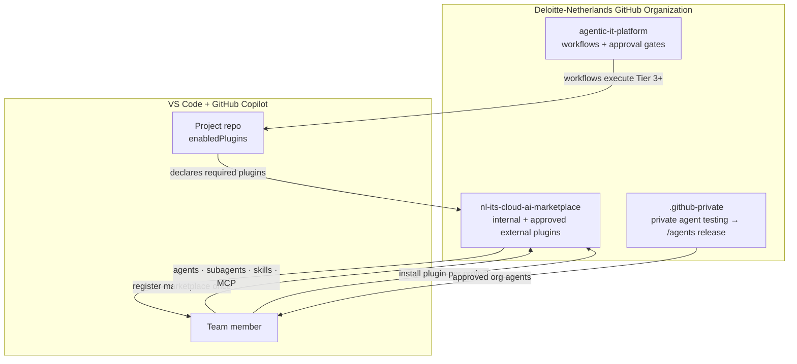
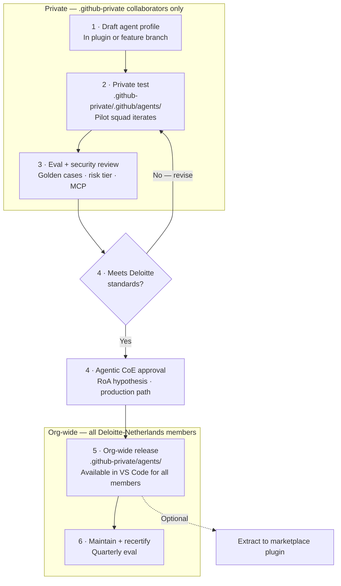
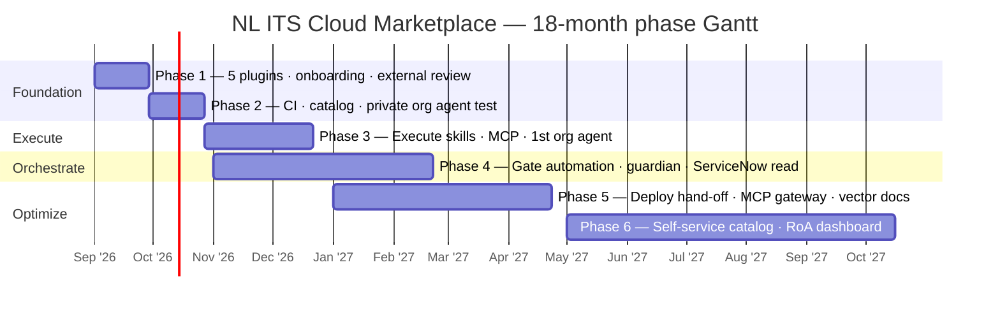
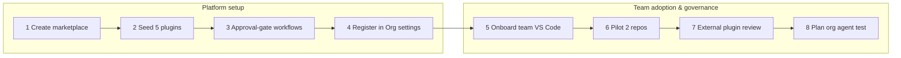

# NL ITS Cloud — Copilot Marketplace Implementation Guide

**Status:** Draft for review  
**Audience:** IT Cloud / platform team, engineers, AI platform owner, security  
**Date:** 2026-09-02  
**Organization:** [Deloitte-Netherlands](https://github.com/Deloitte-Netherlands)  
**Marketplace repository:** `nl-its-cloud-ai-marketplace`  
**Basis:** [IT Cloud Team AI roadmap](./it-cloud-team-ai-roadmap.md) · [GitHub agentic IT control plane](../architecture/github-agentic-it-control-plane.md) · [ADR 002 — Agent / skill / workflow split](../decisions/002-agent-skill-workflow-split.md)

**Visual edition:** [nl-its-cloud-copilot-marketplace.html](./nl-its-cloud-copilot-marketplace.html)

---

## 1. Executive summary

This guide applies the [IT Cloud Team AI roadmap](./it-cloud-team-ai-roadmap.md) to the **Deloitte-Netherlands** GitHub Organization using **GitHub Copilot in VS Code** as the primary agentic surface for engineers.

The operating model:

1. **One sanctioned marketplace** — `Deloitte-Netherlands/nl-its-cloud-ai-marketplace` — is the central catalog of approved Copilot plugins (internal and Deloitte-compliant external).
2. **Every team member registers the marketplace** in VS Code (or Copilot CLI) once.
3. **Projects install only the plugins they need** — infrastructure delivery adds `agentic-infra-ops`; documentation work adds `documentation-writer`; design deliverables add `diagram-design` or `presentation-design`; ITSM flows add `servicenow-ops`.
4. **Plugins bundle the agentic primitives** — agents, subagents, skills, scripts, and MCP configuration — so adoption is consistent and reviewable.
5. **Contributions flow through pull requests** with named owners, risk tiers, and evaluation gates aligned to the roadmap phases.
6. **Future: org-level custom agents** — tested privately in `.github-private` until they meet Deloitte standards, then published org-wide.



---

## 2. Design principles

| Principle | What it means for the marketplace |
| --- | --- |
| **Plugins are the distribution unit** | Agents, subagents, and skills are not copied repo-by-repo. They ship in versioned plugins installed from the org marketplace. |
| **Install on demand** | A documentation repo does not need `agentic-infra-ops`. An IaC repo does. The project README and `enabledPlugins` declare what is required. |
| **Agents propose; workflows execute** | Plugins may draft plans, diagrams, PRs, and change records. Production mutations run only through GitHub Actions with OIDC, environment protection, and stage approval gates (ADR 002). |
| **No shadow MCP** | MCP servers are declared in plugin `.mcp.json`, reviewed in the marketplace PR, and registered through approved paths — not ad-hoc `npx` installs. |
| **External plugins are curated** | Third-party plugins are listed only after Deloitte compliance review (security, data handling, license). |
| **Org agents graduate from private testing** | Custom agents start in `.github-private/.github/agents`, pass evals and security review, then move to `/agents` for org-wide availability. |
| **Contributions are PRs** | Any team member may propose a plugin or skill improvement. Release requires CODEOWNERS review and passing evals. |

---

## 3. Organization repository topology

| Repository | Responsibility | Roadmap phase |
| --- | --- | --- |
| **`nl-its-cloud-ai-marketplace`** | `marketplace.json`, internal plugins, approved external plugin references, catalog metadata, contribution guide | Phase 1 (bootstrap) |
| **`.github-private`** | Private agent testing (`.github/agents`), org-wide agents (`/agents` after approval), policies, emergency-disable runbook | Phase 2+ |
| **`agentic-it-platform`** | Reusable GitHub Actions workflows, approval-gate orchestration, OIDC trust, evaluation suites | Phase 2–3 |
| **Project repositories** | Declare `enabledPlugins`, `copilot-instructions.md`, optional repo-scoped agents | Phase 1+ |

---

## 4. Marketplace repository structure

Target layout for `Deloitte-Netherlands/nl-its-cloud-ai-marketplace`:

```text
nl-its-cloud-ai-marketplace/
├── marketplace.json              # Internal + approved external plugins
├── README.md
├── CONTRIBUTING.md
├── CODEOWNERS
├── catalog/                      # Governance metadata per plugin
│   ├── agentic-infra-ops.yaml
│   ├── documentation-writer.yaml
│   ├── diagram-design.yaml
│   ├── presentation-design.yaml
│   ├── servicenow-ops.yaml
│   └── external/                 # Compliance records for third-party plugins
├── plugins/
│   ├── agentic-infra-ops/
│   ├── documentation-writer/
│   ├── diagram-design/
│   ├── presentation-design/
│   └── servicenow-ops/
├── external/                     # Pointers / mirrors to approved third-party plugins
│   └── README.md
├── evals/
└── .github/workflows/
    ├── validate-marketplace.yml
    └── plugin-eval.yml
```

### 4.1 Root `marketplace.json`

```json
{
  "name": "nl-its-cloud-ai-marketplace",
  "owner": {
    "name": "Deloitte Netherlands — IT Cloud Team",
    "email": "its-cloud-ai@deloitte.nl"
  },
  "metadata": {
    "description": "Sanctioned Copilot plugins for IT Cloud — internal and Deloitte-compliant external",
    "version": "1.0.0"
  },
  "plugins": [
    {
      "name": "agentic-infra-ops",
      "description": "End-to-end infrastructure delivery — requirements through deploy with approval gates",
      "version": "0.1.0",
      "source": "./plugins/agentic-infra-ops"
    },
    {
      "name": "documentation-writer",
      "description": "Deloitte-style documentation from codebase and remote workspace analysis",
      "version": "0.1.0",
      "source": "./plugins/documentation-writer"
    },
    {
      "name": "diagram-design",
      "description": "40+ diagram types in Deloitte branded style as HTML/SVG/PNG",
      "version": "0.1.0",
      "source": "./plugins/diagram-design"
    },
    {
      "name": "presentation-design",
      "description": "Deloitte branded presentations and slide decks",
      "version": "0.1.0",
      "source": "./plugins/presentation-design"
    },
    {
      "name": "servicenow-ops",
      "description": "ServiceNow change requests, incident drafts, and ITSM workflows",
      "version": "0.1.0",
      "source": "./plugins/servicenow-ops"
    }
  ]
}
```

External plugins are added to the same `marketplace.json` after compliance review, with `source` pointing to an approved mirror or upstream repo (see §6).

---

## 5. Internal plugin portfolio

### 5.1 `agentic-infra-ops` — End-to-end infrastructure delivery

**Focus:** Orchestrated infrastructure delivery from requirements through documentation, with **human approval gates** at each stage. Primary IaC: Terraform (extensible to Bicep/CloudFormation).

#### Orchestrator and subagents

| Role | Agent / subagent | Responsibility |
| --- | --- | --- |
| **Orchestrator** | `infra-delivery-orchestrator` | Routes work across stages; enforces gate sequence; hands off to GitHub Actions at deploy |
| **Subagent** | `requirements-analyst` | Elicits and structures functional/non-functional requirements; acceptance criteria |
| **Subagent** | `architecture-designer` | Produces high-level architecture, component boundaries, integration patterns |
| **Subagent** | `solution-designer` | Detailed design: data flows, interfaces, operational model |
| **Subagent** | `governance-reviewer` | Applies guardrails, policies, risk tier, sovereign cloud map, compliance checks |
| **Subagent** | `iac-planner` | Drafts Terraform plan scope, module layout, state strategy, blast-radius analysis |
| **Subagent** | `iac-developer` | Authors IaC modules, variables, tests; opens PRs — never applies directly |
| **Subagent** | `deployment-coordinator` | Prepares deploy runbook, environment checklist, rollback plan; triggers gated workflow |
| **Subagent** | `documentation-author` | As-built docs, runbooks, ADRs from delivered infrastructure |

#### Skills

| Skill | Stage | Purpose |
| --- | --- | --- |
| `gather-requirements` | Requirements | Structured intake from issue/PRD; gap analysis |
| `draft-architecture` | Architecture | HLD/LLD drafts aligned to Deloitte reference architectures |
| `draft-solution-design` | Design | Interface specs, sequence flows, capacity notes |
| `review-governance` | Governance | Policy-as-code check, data classification, tier assignment |
| `review-guardrails` | Governance | Guardian rules, prohibited actions, approval matrix |
| `plan-terraform` | IaC plan | Module graph, plan summary, destructive change flags |
| `author-terraform` | IaC code | Module scaffolding, variable validation, test stubs |
| `review-terraform-plan` | IaC plan | Parse plan output; map changes to risk tier |
| `prepare-deploy-runbook` | Deploy | Pre/post checks, rollback steps, verification criteria |
| `draft-rollback-notes` | Deploy | State-aware rollback from plan + state |
| `draft-infra-docs` | Docs | Runbooks, as-built, operational handover |

#### Tools (scripts + MCP)

| Tool | Type | Scope |
| --- | --- | --- |
| `scripts/parse-plan.sh` | Script | Terraform plan parsing |
| `scripts/policy-check.py` | Script | Policy-as-code validation |
| `scripts/module-scaffold.py` | Script | Standard module layout |
| `mcp:service-catalog-read` | MCP (Phase 3+) | Read-only CMDB / catalog |
| `mcp:cost-estimate-read` | MCP (Phase 3+) | Read-only cost telemetry |

#### Workflow with approval gates

Each stage produces a **draft artifact** (issue comment, PR, or catalog entry). The next stage does not start until the gate is approved — by human reviewer, CODEOWNERS, or a protected GitHub Environment.

```mermaid
flowchart TB
  ORCH["infra-delivery-orchestrator"]

  ORCH --> S1["Stage 1 · Requirements<br/>Subagent: requirements-analyst<br/>Output: requirements doc"]
  S1 --> G1{"◇ Gate<br/>Product lead"}
  G1 --> S2["Stage 2 · Architecture<br/>Subagent: architecture-designer<br/>Output: HLD + diagram"]
  S2 --> G2{"◇ Gate<br/>Cloud architect"}
  G2 --> S3["Stage 3 · Design<br/>Subagent: solution-designer<br/>Output: detailed design"]
  S3 --> G3{"◇ Gate<br/>Solution architect"}
  G3 --> S4["Stage 4 · Governance<br/>Subagent: governance-reviewer<br/>Guardrails · policies · risk tier"]
  S4 --> G4{"◇ Gate<br/>Security + AI Platform"}
  G4 --> S5["Stage 5 · IaC plan<br/>Subagent: iac-planner<br/>Output: terraform plan summary"]
  S5 --> G5{"◇ Gate<br/>Platform engineer"}
  G5 --> S6["Stage 6 · IaC code<br/>Subagent: iac-developer<br/>Output: PR — no apply"]
  S6 --> G6{"◇ Gate<br/>CODEOWNERS"}
  G6 --> S7["Stage 7 · Deploy<br/>Subagent: deployment-coordinator<br/>ServiceNow change · GitHub Actions · OIDC"]
  S7 --> G7{"◇ Gate<br/>Env approvers"}
  G7 --> S8["Stage 8 · Docs<br/>Subagent: documentation-author<br/>Runbooks · as-built · handover"]
  S8 --> G8{"◇ Gate<br/>Service owner"}
```



| Stage | Gate | Approver | Output |
| --- | --- | --- | --- |
| **1. Requirements** | Requirements sign-off | Product / platform lead | Structured requirements doc in issue or `/docs/requirements/` |
| **2. Architecture** | Architecture review | Cloud architect | HLD in `/docs/architecture/` or linked diagram |
| **3. Design** | Design review | Solution architect | Detailed design doc, interface specs |
| **4. Governance** | Policy / risk gate | Security + AI Platform Owner | Tier assignment, guardrail checklist, policy-as-code pass |
| **5. IaC plan** | Plan review | Cloud platform engineer | `terraform plan` summary, blast-radius report |
| **6. IaC code** | PR review | CODEOWNERS + peer | Merged IaC PR (no apply) |
| **7. Deploy** | Environment approval | Protected environment reviewers | GitHub Actions workflow with OIDC — **human-triggered** |
| **8. Docs** | Documentation review | Service owner | Runbook, as-built, handover in repo |

**Explicit prohibitions:** No `terraform apply`, cloud write, or IAM change via agent or MCP. Deploy is workflow-only with environment protection.

---

### 5.2 `documentation-writer` — Deloitte-style documentation

**Focus:** Produce consistent, client-ready documentation by analyzing the local codebase or a **remote workspace** (GitHub Codespaces, dev container, or connected repo).

| Component | Contents | Autonomy | Tier |
| --- | --- | --- | --- |
| **Agent** `documentation-author` | Plans doc structure, selects audience and tone, coordinates skills | Suggest → Execute | 0–1 |
| **Skill** `analyze-codebase` | Walks repo structure, entry points, APIs, config; builds outline | Execute | 0 |
| **Skill** `write-deloitte-doc` | Applies Deloitte style guide: headings, voice, disclaimers, formatting | Execute | 0–1 |
| **Skill** `document-api` | OpenAPI/README/API reference from code | Suggest | 0–1 |
| **Skill** `document-runbook` | Operational procedures from workflows, scripts, infra | Suggest | 0–1 |
| **Skill** `remote-workspace-scan` | Indexes remote or multi-root workspace for cross-repo docs | Execute (Phase 3) | 0 |
| **Assets** | Deloitte doc templates, style tokens, disclaimer blocks | — | — |

**Use cases:** README refresh, architecture decision records, handover packs, API docs, operational runbooks.

---

### 5.3 `diagram-design` — 40+ diagrams in Deloitte branded style

**Focus:** Consistent, branded technical visuals for architecture, design, and client deliverables.

| Component | Contents | Autonomy | Tier |
| --- | --- | --- | --- |
| **Agent** `diagram-designer` | Selects diagram type, applies Deloitte brand profile, produces output | Suggest → Execute | 0–1 |
| **Skill** `diagram-design` | **40+ types:** architecture, data-flow, deployment, sequence, state, ER, timeline, swimlane, Wardley, Gantt, sankey, org chart, pyramid, quadrant, radar, polar, loop, journey, kanban, fishbone, UML class, and more | Execute | 0–1 |
| **Assets** | Deloitte color tokens, typography, HTML/SVG templates, icon set | — | — |

**Seed source:** Adapt from [`plugins/diagram-design`](../../plugins/diagram-design/) in this architecture repo, re-branded for Deloitte Netherlands.

**Integration:** Used by `agentic-infra-ops` (architecture stage) and `presentation-design` (embedded visuals).

---

### 5.4 `presentation-design` — Deloitte branded presentations

**Focus:** Client-facing and internal slide decks with consistent Deloitte branding.

| Component | Contents | Autonomy | Tier |
| --- | --- | --- | --- |
| **Agent** `presentation-designer` | Structures narrative, selects layout, applies brand | Suggest | 0–1 |
| **Skill** `build-slide-deck` | HTML slide decks (16:9, 4:3); export to PDF where supported | Suggest | 0–1 |
| **Skill** `apply-brand-tokens` | Deloitte colors, fonts, logos from approved token file | Assist | 0 |
| **Skill** `embed-diagrams` | Pulls visuals from `diagram-design` skill into slides | Suggest | 0–1 |
| **Assets** | Slide templates, master layouts, speaker notes patterns | — | — |

---

### 5.5 `servicenow-ops` — ServiceNow ITSM operations

**Focus:** Draft and create ServiceNow records from agent context — change requests, incident updates, catalog tasks. Start create-only; expand read+update after governance maturity.

#### Agents

| Agent | Responsibility | Autonomy | Tier |
| --- | --- | --- | --- |
| `change-request-agent` | Drafts and submits change requests from PR/plan context | Suggest → Execute (Phase 3) | 1–2 |
| `incident-assistant` | Drafts incident timeline, work notes, resolution summaries | Suggest | 0–1 |
| `itsm-intake-agent` | Classifies requests, maps to catalog, requests missing fields | Execute (Phase 3) | 1–2 |

#### Skills

| Skill | Purpose |
| --- | --- |
| `create-change-request` | Structured change record from IaC PR, plan, and risk tier |
| `draft-change-plan` | Implementation, test, and backout plan sections for change form |
| `link-change-to-pr` | Associates GitHub PR/issue with ServiceNow change number |
| `draft-incident-update` | Commander-ready incident work notes and status |
| `find-cmdb-item` | Read-only lookup of configuration item / service (Phase 3) |
| `validate-change-window` | Checks change window and blackout rules (read-only) |

#### Tools

| Tool | Type | Scope |
| --- | --- | --- |
| `mcp:servicenow-create` | MCP (Phase 3) | Create change, incident task — narrow schema |
| `mcp:servicenow-read` | MCP (Phase 3) | Read CMDB, change status, assignment groups |
| `scripts/change-payload.json` | Script template | Validated payload shape for change API |

**Integration with `agentic-infra-ops`:** Stage 7 (Deploy) gate may require an approved ServiceNow change record created via `servicenow-ops` before the deploy workflow runs.

**Explicit prohibitions (Phase 1–2):** Draft-only — no autonomous change implementation or incident closure.

---

## 6. Approved external plugins

The marketplace also lists **third-party plugins** that have passed Deloitte compliance review. These are not maintained in `plugins/` but referenced (or mirrored) under `external/`.

### 6.1 Compliance criteria

| Criterion | Requirement |
| --- | --- |
| **License** | Compatible with organizational use (no copyleft conflicts where policy forbids) |
| **Security** | No known malicious patterns; scripts reviewed; MCP endpoints approved |
| **Data handling** | No exfiltration of client or restricted data; no unauthorized external API calls |
| **Maintenance** | Named upstream; version pinning; deprecation path documented |
| **Audit** | Compliance record in `catalog/external/<plugin>.yaml` with reviewer and date |

### 6.2 Listing pattern in `marketplace.json`

```json
{
  "name": "example-upstream-plugin",
  "description": "Approved external plugin — compliance ref EXT-2026-001",
  "version": "2.1.0",
  "source": {
    "source": "github",
    "repo": "Deloitte-Netherlands/mirror-example-plugin"
  }
}
```

Prefer **org-owned mirrors** of public plugins so sync and review stay under Deloitte-Netherlands control.

### 6.3 External plugin lifecycle

```text
Nomination → Security + license review → Mirror (if public) → catalog/external/*.yaml
  → marketplace.json entry → Pilot install → Org-wide availability
```

Team members install external plugins **only** from `nl-its-cloud-ai-marketplace` — not directly from public marketplaces.

---

## 7. Future consideration — organization-level custom agents

Plugins distribute **project-scoped** capabilities. Some agents should be available to **every org member** without per-repo install — for example IT Intake, Daily Operations, or Guardian oversight agents.

### 7.1 Private testing path

GitHub supports org custom agents in two locations:

| Location | Visibility | Use |
| --- | --- | --- |
| `.github-private/.github/agents/` | Collaborators on `.github-private` only | **Private testing** — iterate until Deloitte standards met |
| `.github-private/agents/` (or org `/agents`) | All org members | **Org-wide release** after approval |

### 7.2 Graduation workflow



| Step | Owner | Exit criteria |
| --- | --- | --- |
| **1. Draft** | Agent owner | Profile in Markdown + YAML frontmatter; catalog metadata |
| **2. Private test** | Agent owner + pilot squad | Golden cases pass; no unauthorized tool calls |
| **3. Security review** | Security + AI Platform Owner | Risk tier, MCP, data classification signed off |
| **4. CoE approval** | Agentic CoE | RoA hypothesis; production path documented |
| **5. Org release** | AI Platform Owner | Move profile to `/agents`; announce in marketplace README |
| **6. Maintain** | Agent owner | Quarterly recertification; eval regression on change |

**Relationship to marketplace:** Org agents handle **cross-cutting** roles (intake, briefing, guardian). Marketplace plugins handle **domain-specific** work (infra delivery, diagrams, ServiceNow). An agent may graduate from a plugin into an org agent when adoption is org-wide.

**Timeline:** Phase 2 (private testing infrastructure) → Phase 3 (first org agent graduation) → Phase 4+ (guardian and orchestration agents).

---

## 8. Team member setup — VS Code + GitHub Copilot

### 8.1 Register the organization marketplace

```bash
copilot plugin marketplace add Deloitte-Netherlands/nl-its-cloud-ai-marketplace
```

In Copilot Chat: `/plugin marketplace add Deloitte-Netherlands/nl-its-cloud-ai-marketplace`

### 8.2 Install plugins (per project)

```bash
# Infrastructure delivery
copilot plugin install agentic-infra-ops@nl-its-cloud-ai-marketplace

# Documentation
copilot plugin install documentation-writer@nl-its-cloud-ai-marketplace

# Diagrams and presentations
copilot plugin install diagram-design@nl-its-cloud-ai-marketplace
copilot plugin install presentation-design@nl-its-cloud-ai-marketplace

# ServiceNow / ITSM
copilot plugin install servicenow-ops@nl-its-cloud-ai-marketplace
```

### 8.3 Verify and update

- Agent picker shows plugin agents (e.g. `infra-delivery-orchestrator`, `documentation-author`).
- `/plugin marketplace browse nl-its-cloud-ai-marketplace` lists internal and approved external plugins.
- `copilot plugin marketplace update nl-its-cloud-ai-marketplace` after merges.

---

## 9. Project adoption pattern

| Project type | Required plugins | Optional plugins |
| --- | --- | --- |
| IaC / platform repo | `agentic-infra-ops`, `servicenow-ops` | `diagram-design`, `documentation-writer` |
| Application repo | `documentation-writer` | `diagram-design` |
| Architecture / design | `diagram-design` | `presentation-design`, `documentation-writer` |
| Client deliverable | `presentation-design`, `diagram-design` | `documentation-writer` |
| ITSM-integrated change | `servicenow-ops` | `agentic-infra-ops` |

Example `enabledPlugins`:

```json
{
  "enabledPlugins": {
    "agentic-infra-ops@nl-its-cloud-ai-marketplace": true,
    "servicenow-ops@nl-its-cloud-ai-marketplace": true,
    "diagram-design@nl-its-cloud-ai-marketplace": false
  }
}
```

---

## 10. Contribution workflow

| Type | Reviewer |
| --- | --- |
| Skill improvement | Skill owner |
| New skill / subagent | Plugin owner + security (if scripts/MCP) |
| New internal plugin | AI Platform Owner + Security |
| External plugin nomination | Security + Compliance + AI Platform Owner |
| Org agent graduation | Security + CoE + AI Platform Owner |
| MCP server addition | Security (mandatory) |

### CODEOWNERS (example)

```text
/plugins/agentic-infra-ops/      @Deloitte-Netherlands/cloud-platform-team
/plugins/documentation-writer/     @Deloitte-Netherlands/its-cloud-ai-platform
/plugins/diagram-design/           @Deloitte-Netherlands/cloud-architecture
/plugins/presentation-design/      @Deloitte-Netherlands/cloud-architecture
/plugins/servicenow-ops/           @Deloitte-Netherlands/cloud-platform-team
/external/                         @Deloitte-Netherlands/security-review
catalog/                           @Deloitte-Netherlands/its-cloud-ai-platform @Deloitte-Netherlands/security-review
```

---

## 11. Roadmap phase mapping

How the marketplace matures across the [18-month IT Cloud roadmap](./it-cloud-team-ai-roadmap.md):



| Phase | Timing | Marketplace deliverables | Autonomy |
| --- | --- | --- | --- |
| **1** | Weeks 1–4 | Create marketplace; publish 5 internal plugins (draft-only); team onboarding; 1–2 approved external plugins | Assist → Suggest |
| **2** | Weeks 5–8 | CI validation; catalog metadata; CODEOWNERS; private org agent testing in `.github-private` | Suggest |
| **3** | Weeks 9–16 | Execute skills (`servicenow-ops` create-change; `agentic-infra-ops` IaC stages); read-only MCP; first org agent graduation | Suggest → Execute |
| **4** | Months 5–8 | Full infra delivery orchestration with gate automation; guardian hooks; ServiceNow read integration | Execute → Orchestrate |
| **5** | Months 9–12 | Deploy workflow hand-off; MCP gateway; vector-indexed docs in `documentation-writer` | Orchestrate → Optimize |
| **6** | Months 13–18 | Self-service catalog; multi-plugin workflows; executive RoA dashboard | Optimize |

---

## 12. Governance and security

| Control | Implementation |
| --- | --- |
| **Sanctioned path only** | Internal + approved external plugins from `nl-its-cloud-ai-marketplace` only |
| **Stage gates** | `agentic-infra-ops` enforces sequential approval before deploy |
| **No prod mutation in plugins** | Deploy via protected GitHub Actions only |
| **External plugin compliance** | `catalog/external/*.yaml` with reviewer, date, license, data class |
| **Org agent graduation** | Private test → eval → security → CoE → `/agents` release |
| **Emergency disable** | Org admin disables plugin version or agent profile; runbook in `.github-private` |

---

## 13. Return-on-Autonomy — marketplace metrics

| Metric | Target (Phase 3) | Target (Phase 6) |
| --- | --- | --- |
| Team members with marketplace registered | 100% | 100% |
| Active repos with `enabledPlugins` | ≥5 | ≥20 |
| Infra deliveries using gated `agentic-infra-ops` flow | ≥2 pilots | ≥10 |
| Change requests created via `servicenow-ops` | ≥5/month | ≥20/month |
| Diagrams via `diagram-design` in deliverables | ≥10/month | ≥30/month |
| Org-level custom agents in production | ≥1 | ≥4 |
| Unauthorized external / shadow plugin incidents | 0 | 0 |

---

## 14. Workshop series

Four enablement workshops onboard the IT Cloud team on the agentic stack, VS Code setup, skills authoring, and roadmap next steps.

### Workshop 1 — How everything works together

Explain how the **harness** (GitHub Copilot in VS Code) orchestrates **agents**, **skills**, **tools** (MCP, scripts), the **LLM**, and the **knowledge graph** (RAG, runbooks, vector fabric).

**Materials:** [workshop-01-agentic-stack.html](./workshops/workshop-01-agentic-stack.html) · [workshop-01-agentic-stack.md](./workshops/workshop-01-agentic-stack.md)

### Workshop 2 — VS Code setup & marketplace

Hands-on: register `Deloitte-Netherlands/nl-its-cloud-ai-marketplace`, install plugins, declare `enabledPlugins`.

**Materials:** [workshop-02-vscode-setup.html](./workshops/workshop-02-vscode-setup.html) · [workshop-02-vscode-setup.md](./workshops/workshop-02-vscode-setup.md)

### Workshop 3 — Continue with skills

- Author and test `SKILL.md` files inside marketplace plugins
- Contribution workflow, CODEOWNERS, eval stubs
- Map skills to agents and risk tiers

**Materials:** [workshop-03-skills.html](./workshops/workshop-03-skills.html) · [workshop-03-skills.md](./workshops/workshop-03-skills.md)

### Workshop 4 — Brainstorm next steps

- Pilot repo selection and `enabledPlugins` rollout
- First org agent private test in `.github-private`
- External plugin nominations and Phase 2 priorities

| Workshop | Topic | Materials |
| --- | --- | --- |
| **1** | Agentic stack & evolution LLM → harness | [Workshop 1 page](./workshops/workshop-01-agentic-stack.html) |
| **2** | VS Code + marketplace setup | [Workshop 2 page](./workshops/workshop-02-vscode-setup.html) |
| **3** | Skills authoring & contribution | [Workshop 3 page](./workshops/workshop-03-skills.html) |
| **4** | Brainstorm next steps | Roadmap §11 · Immediate actions |

---

## 15. Immediate actions

**Phase 1 — coming month.** Eight deliverables grouped by platform setup, then team adoption and governance.



| # | Action | Owner | Exit signal |
| --- | --- | --- | --- |
| **1** | **Create** `nl-its-cloud-ai-marketplace` with structure in §4 | AI Platform Owner | Repo live with `marketplace.json` |
| **2** | **Seed** five internal plugins (§5); prioritize `diagram-design` and `agentic-infra-ops` | Plugin owners | All 5 plugins in catalog |
| **3** | **Define** approval-gate workflows in `agentic-it-platform` | Cloud Platform | 8-stage gate workflow stub |
| **4** | **Register** marketplace in Organization settings → Plugins | AI Platform Owner + Org admin | Sync automatically enabled |
| **5** | **Onboard** team in VS Code (§8) | AI Platform Owner | 100% team registered |
| **6** | **Pilot** on 2 repos: IaC (`agentic-infra-ops` + `servicenow-ops`) and deliverable (`diagram-design` + `presentation-design`) | Platform lead | `enabledPlugins` on both repos |
| **7** | **Charter** external plugin review process (§6) | Security + AI Platform | `catalog/external/` template published |
| **8** | **Plan** first org agent private test in `.github-private` (§7) for Phase 2 | AI Platform Owner | Private test charter approved |

---

## 16. Related documents

- [Workshop 1 — Agentic stack](./workshops/workshop-01-agentic-stack.md)
- [Workshop 2 — VS Code setup & marketplace](./workshops/workshop-02-vscode-setup.md)
- [Workshop 3 — Skills authoring](./workshops/workshop-03-skills.md)
- [IT Cloud Team — Agentic AI roadmap](./it-cloud-team-ai-roadmap.md)
- [GitHub-centered agentic IT control plane](../architecture/github-agentic-it-control-plane.md)
- [ADR 002 — Agent / skill / workflow split](../decisions/002-agent-skill-workflow-split.md)
- [GitHub Copilot — About plugins](https://docs.github.com/en/copilot/concepts/agents/about-plugins)
- [GitHub Copilot — Prepare custom agents for organization](https://docs.github.com/en/copilot/how-tos/administer-copilot/manage-for-organization/prepare-for-custom-agents)
- [GitHub Copilot — Test custom agents](https://docs.github.com/en/copilot/how-tos/copilot-on-github/customize-copilot/customize-cloud-agent/test-custom-agents)
