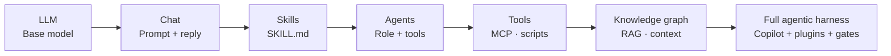

# Workshop 1 — How the agentic stack works together

**Audience:** IT Cloud team engineers and leads  
**Duration:** ~60 minutes  
**Prerequisites:** Basic familiarity with LLMs and GitHub Copilot Chat

**Visual edition:** [workshop-01-agentic-stack.html](./workshop-01-agentic-stack.html)  
**Parent guide:** [NL ITS Cloud Copilot marketplace](../nl-its-cloud-copilot-marketplace.md)

---

## Learning objectives

By the end of this workshop, participants can:

1. Explain the evolution from a raw **LLM** to a full **agentic harness**
2. Describe how **Harness**, **Agent**, **Skills**, **Tools**, **LLM**, and **Knowledge graph** relate
3. Identify which primitive owns a given capability (agent vs skill vs workflow)
4. Map our stack to the [GitHub-centered control plane](../../architecture/github-agentic-it-control-plane.md)

---

## Part 1 — Evolution: LLM to full agentic setup

Copilot started as model-in-the-loop chat. The IT Cloud agentic stack adds structure so work is repeatable, reviewable, and governable.



| Stage | What you get | Limitation |
| --- | --- | --- |
| **LLM** | Language generation | No context, no tools, no memory of org standards |
| **Chat** | Interactive Q&A in Copilot | Ad-hoc prompts; inconsistent outputs |
| **Skills** | On-demand procedures (`SKILL.md`) | Still needs orchestration and tool access |
| **Agents** | Role, instructions, tool scope | Needs distribution and governance |
| **Tools** | MCP servers, scripts, APIs | Needs policy, secrets, audit |
| **Knowledge graph** | Runbooks, CMDB, vector index | Needs retrieval boundaries |
| **Full harness** | Plugins + marketplace + approval gates | Our operating model |

---

## Part 2 — How components work together

The **harness** is GitHub Copilot in VS Code (and cloud agent) plus org plugins from `nl-its-cloud-ai-marketplace`. It orchestrates a session; it does not replace governance or deterministic execution.

| Component | Role | Example in our stack |
| --- | --- | --- |
| **Harness** | Session orchestration — agent picker, plugin load, chat | VS Code + Copilot Chat + `enabledPlugins` |
| **LLM** | Reasoning and language generation | Copilot model endpoint |
| **Agent** | Specialized role with instructions and tool scope | `infra-delivery-orchestrator` |
| **Skills** | Callable procedures loaded when the task needs them | `review-terraform-plan`, `diagram-design` |
| **Tools** | MCP servers, scripts, APIs the agent may invoke | ServiceNow MCP, `parse-plan.sh` |
| **Knowledge graph** | Retrieved context — runbooks, docs, CMDB | Vector index, catalog read APIs |

### Accountability line (ADR 002)

```text
Agent decides what should be proposed.
Skill explains how to perform a specialized task.
Workflow validates and performs an approved action.
Human remains accountable for high-impact decisions.
GitHub records the complete change and approval history.
```

| Primitive | Owns |
| --- | --- |
| **Agent** | Role, risk tier, tool scope, expected outputs |
| **Skill** | Step-by-step procedure for one specialized task |
| **Plugin** | Versioned bundle of agents, skills, hooks, MCP config |
| **Workflow** | Deterministic GitHub Actions execution with approvals |

---

## Part 3 — Request flow through the harness

A typical infra request illustrates how layers cooperate:

1. **Human** opens Copilot Chat in VS Code and selects `infra-delivery-orchestrator`
2. **Harness** loads the `agentic-infra-ops` plugin (agents, skills, MCP config)
3. **Agent** interprets intent and selects skills (e.g. `review-terraform-plan`)
4. **Skill** guides the model through Deloitte-standard steps
5. **Tools** fetch context (MCP read) or run scripts (parse plan output)
6. **Knowledge graph** supplies runbooks and architecture context via RAG
7. **LLM** drafts the proposal; **human** approves at gate checkpoints
8. **Workflow** (GitHub Actions) executes approved changes — not the agent directly

---

## Part 4 — Control plane vs runtime

GitHub is the **control plane** — source of truth for agents, plugins, policies, and audit. Sensitive operations run in cloud runtime behind an MCP/API gateway.

```text
Humans / IT systems
        |
        v
Issues, PRs, Copilot, CLI
        |
        v
GitHub Organization (control plane)
  agents | plugins/skills | policies | workflows | audit
        |
   +----+----+----------------+
   v         v                v
Copilot    GitHub Actions   Cloud runtime
cloud      (deterministic)  (MCP gateway)
agents
        |
        v
Service catalog, ITSM, cloud APIs
```

**Trust boundaries:**

1. Agents draft and recommend; humans approve Tier 3+ actions
2. Agents propose; workflows execute with least privilege
3. Only the MCP gateway talks to ITSM, CMDB, and cloud control planes
4. IDE sessions are policy-controlled separately from org cloud agents

---

## Exercise

1. Pick a real IT Cloud task (e.g. "draft a change request for a Terraform apply")
2. Label each step with: Harness, Agent, Skill, Tool, Knowledge, LLM, Human, Workflow
3. Identify one step that must **never** be autonomous (human gate)
4. Find the matching plugin in `nl-its-cloud-ai-marketplace`

---

## Related workshops

- Workshop 2 — [VS Code setup & marketplace](./workshop-02-vscode-setup.md)
- [Workshop 3 — Continue with skills](./workshop-03-skills.md)
- Workshop 4 — Brainstorm next steps ([marketplace §14](../nl-its-cloud-copilot-marketplace.md#14-workshop-series))
