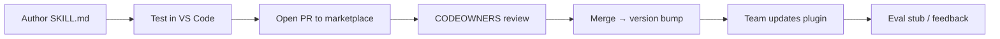

# Workshop 3 — Continue with skills

**Audience:** IT Cloud team engineers contributing to marketplace plugins  
**Duration:** ~90 minutes  
**Prerequisites:** [Workshop 1](./workshop-01-agentic-stack.md) · [Workshop 2](./workshop-02-vscode-setup.md) · marketplace registered in VS Code

**Visual edition:** [workshop-03-skills.html](./workshop-03-skills.html)  
**Parent guide:** [NL ITS Cloud Copilot marketplace](../nl-its-cloud-copilot-marketplace.md)

---

## Learning objectives

By the end of this workshop, participants can:

1. Author a well-structured `SKILL.md` inside a marketplace plugin
2. Test a skill locally via Copilot Chat with the plugin installed
3. Follow the contribution workflow (branch, PR, CODEOWNERS review)
4. Map a skill to an agent and assign a risk tier

---

## Part 1 — What is a skill?

A **skill** is an on-demand procedure for a specialized task. It ships as a `SKILL.md` file (with optional `references/`, `scripts/`, and assets) inside a plugin's `skills/` directory.

| | Agent | Skill | Workflow |
| --- | --- | --- | --- |
| **Purpose** | Role and orchestration | How to do one task well | Deterministic execution |
| **Loaded** | Agent picker / profile | On demand when relevant | GitHub Actions trigger |
| **Format** | `*.agent.md` | `skills/<name>/SKILL.md` | `.github/workflows/*.yml` |
| **Risk** | Defines tool scope + tier | Describes procedure; may call scripts | Enforces approvals + audit |

**Rule of thumb:** If it is a reusable *how-to* that many agents might need, make it a skill. If it is a *role* with boundaries, make it an agent. If it mutates production, make it a workflow.

---

## Part 2 — SKILL.md anatomy

Every skill starts with YAML frontmatter and a focused body. Keep skills **single-purpose** and **actionable**.

```markdown
---
name: review-terraform-plan
description: Review a Terraform plan output against Deloitte infra standards and flag risks.
license: MIT
metadata:
  version: "0.1"
  risk-tier: "1"
  owner: cloud-platform-team
---

# Review Terraform plan

## When to use
Use when the user provides `terraform plan` output or a saved plan file.

## Steps
1. Parse plan for create/update/destroy counts
2. Check against naming and tagging standards
3. Flag high-risk resources (IAM, networking, data stores)
4. Output a structured review table with severity

## References
Load `references/standards.md` only when checking resource types.
```

### Directory layout inside a plugin

```text
plugins/agentic-infra-ops/
├── plugin.json
├── agents/
│   └── infra-delivery-orchestrator.agent.md
└── skills/
    └── review-terraform-plan/
        ├── SKILL.md              # Required
        ├── references/           # Optional — loaded on demand
        │   └── standards.md
        └── scripts/              # Optional — deterministic helpers
            └── parse-plan.sh
```

### Authoring checklist

| Check | Guideline |
| --- | --- |
| **Name** | Kebab-case; matches directory name |
| **Description** | One line — when Copilot should load this skill |
| **When to use** | Clear triggers; say when *not* to use |
| **Steps** | Numbered, testable, minimal |
| **References** | Split long content into `references/` — load lazily |
| **Scripts** | Prefer read-only; document inputs/outputs |
| **Risk tier** | 0 = read/draft only; 1 = suggest; 2 = execute with approval; 3+ = human gate |

---

## Part 3 — Skill lifecycle



### Contribution workflow

| Change type | Reviewer |
| --- | --- |
| Skill improvement | Skill owner |
| New skill | Plugin owner + security (if scripts/MCP) |
| New internal plugin | AI Platform Owner + Security |
| MCP server addition | Security (mandatory) |

### CODEOWNERS (example)

```text
/plugins/agentic-infra-ops/      @Deloitte-Netherlands/cloud-platform-team
/plugins/documentation-writer/     @Deloitte-Netherlands/its-cloud-ai-platform
/plugins/diagram-design/           @Deloitte-Netherlands/cloud-architecture
/plugins/presentation-design/      @Deloitte-Netherlands/cloud-architecture
/plugins/servicenow-ops/           @Deloitte-Netherlands/cloud-platform-team
```

### Eval stubs

Add a minimal eval case when introducing a new skill:

```text
evals/skills/review-terraform-plan/
├── input.md          # Sample plan output
└── expected.md       # Required sections in the review
```

Evals are not blocking in Phase 1, but every new skill should have a stub so Phase 2 automation can attach.

---

## Part 4 — Map skills to agents

Skills do not run in isolation — agents select them. Document the mapping in the agent profile or plugin README.

| Agent | Example skills | Risk tier |
| --- | --- | --- |
| `infra-delivery-orchestrator` | `review-terraform-plan`, `draft-change-request` | 1–2 |
| `documentation-author` | `audience-tone`, `structure-outline` | 0–1 |
| `diagram-designer` | `diagram-design` | 0 |
| `servicenow-intake` | `draft-incident`, `create-change` | 1–2 |

When a skill calls a script or MCP tool, bump the review path to include **security** even if the agent tier is low.

---

## Part 5 — Hands-on

### Step 1 — Fork and branch

```bash
gh repo fork Deloitte-Netherlands/nl-its-cloud-ai-marketplace --clone
cd nl-its-cloud-ai-marketplace
git checkout -b skill/add-resource-tagging-check
```

### Step 2 — Add a skill

Create `plugins/agentic-infra-ops/skills/check-resource-tags/SKILL.md` using the anatomy above.

### Step 3 — Register in plugin manifest

Ensure `plugin.json` lists the skill path if your manifest enumerates skills explicitly.

### Step 4 — Test locally

```bash
# Point VS Code at your local marketplace clone (dev) or merge to a branch
/plugin install agentic-infra-ops@nl-its-cloud-ai-marketplace
```

In Copilot Chat, ask the orchestrator agent to run your new skill against sample Terraform code.

### Step 5 — Open PR

- Describe trigger conditions and risk tier
- Link eval stub if added
- Request review from CODEOWNERS path

### Step 6 — After merge

```bash
/plugin marketplace update nl-its-cloud-ai-marketplace
/plugin update agentic-infra-ops@nl-its-cloud-ai-marketplace
```

---

## Exercise

1. Choose an existing plugin (`diagram-design` is a good starter — see `plugins/diagram-design/skills/diagram-design/SKILL.md` in this repo)
2. Identify one gap: a sub-procedure that deserves its own skill or a `references/` split
3. Draft a `SKILL.md` outline (frontmatter + When to use + Steps)
4. Assign risk tier and named owner
5. (Optional) Open a draft PR with an eval stub

---

## Related workshops

- [Workshop 1 — Agentic stack](./workshop-01-agentic-stack.md)
- [Workshop 2 — VS Code setup](./workshop-02-vscode-setup.md)
- Workshop 4 — Brainstorm next steps ([marketplace §14](../nl-its-cloud-copilot-marketplace.md#14-workshop-series))
